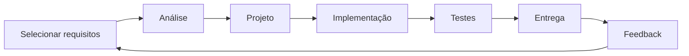
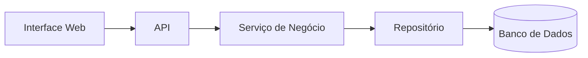
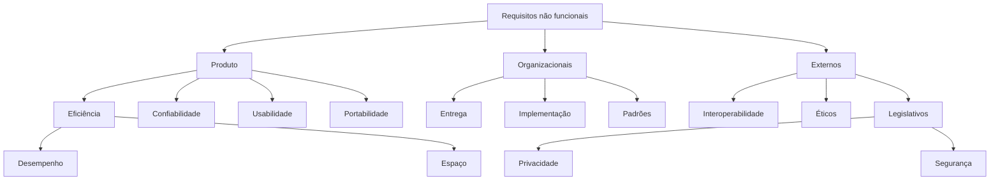
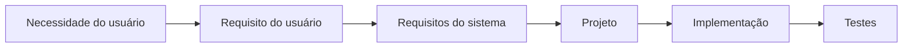
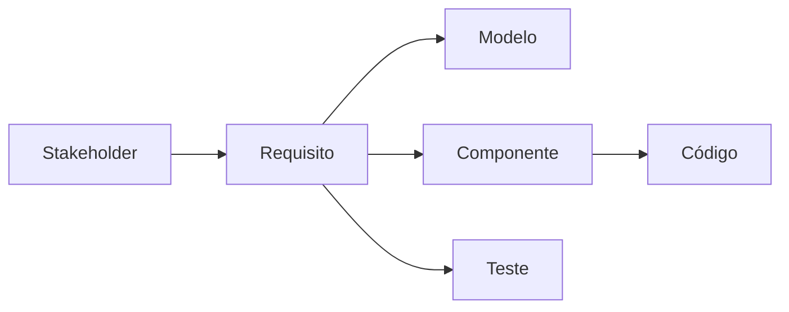
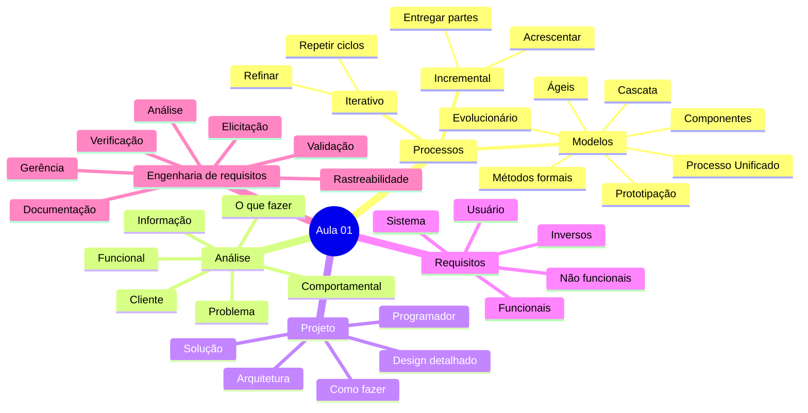

# Aula 01 - Modelos de Processo e Requisitos de Software

> [!abstract] Visão geral
> Esta aula apresenta os fundamentos dos **modelos de processo de software**, o desenvolvimento **iterativo e incremental**, a diferença entre **análise e projeto**, os principais **tipos de requisitos** e as etapas da **engenharia de requisitos**.


---

# 1. Modelos de processo de software

Desenvolver software é uma atividade complexa e sujeita a erros. O sucesso ou fracasso de um projeto depende de diversos fatores que aparecem durante todo o desenvolvimento, como:

- entendimento do problema;
- comunicação com os usuários;
- mudanças de requisitos;
- decisões de arquitetura;
- qualidade da implementação;
- testes;
- planejamento;
- gestão de riscos.

Por isso, o desenvolvimento não deve acontecer de maneira improvisada. É necessário estabelecer um **processo sistemático**.

## 1.1 O que é um modelo de processo?

Um **modelo de processo de software** é uma representação simplificada da forma como o desenvolvimento será organizado. **Representação simplificada da realidade**

Ele define, de maneira geral:

- quais atividades serão realizadas;
- em qual ordem;
- quais artefatos serão produzidos;
- quem participa de cada atividade;
- como o produto será verificado;
- como mudanças serão tratadas.

> [!important] Ideia central
> O modelo de processo não é o software. Ele é uma forma de organizar e orientar o trabalho necessário para construir o software.

## 1.2 Ciclo simplificado de desenvolvimento

Um processo de desenvolvimento pode ser representado pelo seguinte ciclo:


Esse fluxo mostra que o desenvolvimento pode envolver repetição e retorno às etapas anteriores.

### Definição

Busca entender o problema e estabelecer o que será construído.

Pode incluir:

- levantamento de necessidades;
- identificação de usuários;
- definição de requisitos;
- delimitação do escopo.

### Design ou projeto

Define como o software será estruturado para atender aos requisitos.

Pode incluir:

- arquitetura;
- componentes;
- módulos;
- banco de dados;
- interfaces;
- comunicação entre partes do sistema.

### Codificação e testes

Transforma a solução planejada em código executável e verifica seu comportamento.

### Implantação

Disponibiliza o software no ambiente de uso.

Depois da implantação podem surgir:

- correções;
- mudanças;
- novos requisitos;
- melhorias;
- necessidade de novas iterações.

## 1.3 Exemplos de modelos de processo

- Modelo em Cascata;
- Modelo de Prototipação;
- Modelo Evolucionário;
- Desenvolvimento Baseado em Componentes;
- Modelo de Métodos Formais;
- Processo Unificado;
- Modelos Ágeis, como XP e Scrum.

> [!note]
> Nenhum modelo é universalmente melhor. A escolha depende do tipo de projeto, nível de incerteza, riscos, equipe, prazo, criticidade e participação do cliente.

---

# 2. Desenvolvimento iterativo

Um processo **iterativo** busca melhorar ou refinar o sistema gradualmente.

Cada repetição do processo é chamada de **iteração**.

Em uma iteração, pode ocorrer um ciclo completo contendo:

1. análise;
2. projeto;
3. implementação;
4. testes.

## 2.1 Características

- O sistema é revisitado diversas vezes.
- A solução é refinada progressivamente.
- Erros e limitações podem ser identificados mais cedo.
- O conhecimento sobre o problema aumenta ao longo do projeto.
- Cada iteração utiliza os resultados e aprendizados da iteração anterior.

## 2.2 Exemplo

Considere um sistema de busca de livros.

### Primeira iteração

- criar uma busca simples pelo título;
- testar se os resultados são corretos.

### Segunda iteração

- melhorar o algoritmo de busca;
- permitir busca parcial;
- tratar diferenças entre maiúsculas e minúsculas.

### Terceira iteração

- melhorar desempenho;
- refinar a interface;
- corrigir problemas observados pelos usuários.

Nesse exemplo, a funcionalidade principal continua sendo a busca, mas ela é progressivamente refinada.

> [!tip] Forma simples de lembrar
> **Iterar é voltar ao que já existe para melhorar, corrigir ou refinar.**

---

# 3. Desenvolvimento incremental

Um processo **incremental** busca aumentar o sistema pouco a pouco.

Cada incremento acrescenta alguma parte ao produto ou à documentação do projeto.

## 3.1 Um incremento não precisa ser um executável

No início do desenvolvimento, também podem ser considerados incrementos:

- uma nova seção da especificação;
- um diagrama;
- um modelo de domínio;
- um protótipo;
- uma definição de arquitetura;
- uma nova funcionalidade.

Portanto, nem todo incremento gera imediatamente uma nova versão executável.

## 3.2 Exemplo

Considere um sistema acadêmico.

### Primeiro incremento

- autenticação;
- cadastro de usuários.

### Segundo incremento

- cadastro de disciplinas;
- cadastro de turmas.

### Terceiro incremento

- matrícula;
- consulta de horários.

### Quarto incremento

- lançamento de notas;
- emissão de histórico.

A cada incremento, o sistema fica maior e passa a atender uma parte adicional do problema.

> [!tip] Forma simples de lembrar
> **Incrementar é acrescentar algo novo ao produto.**

---

# 4. Iterativo x incremental

Os conceitos são relacionados, mas não são sinônimos.

| Conceito    | Foco principal          | Pergunta                          |
| ----------- | ----------------------- | --------------------------------- |
| Iterativo   | Refinar o que já existe | Como podemos melhorar esta parte? |
| Incremental | Adicionar novas partes  | O que podemos acrescentar agora?  |

Um projeto pode ser:

- iterativo sem ser claramente incremental;
- incremental com pouco refinamento;
- iterativo e incremental ao mesmo tempo.

## 4.1 Desenvolvimento iterativo e incremental

Em abordagens modernas, os dois conceitos normalmente aparecem juntos.

O software é desenvolvido em ciclos ou fases. Em cada ciclo:

1. seleciona-se um subconjunto de requisitos;
2. realiza-se análise;
3. cria-se ou refina-se o projeto;
4. implementa-se;
5. testa-se;
6. entrega-se um resultado;
7. coleta-se feedback.



## 4.2 Priorização

Os requisitos ou histórias do usuário são escolhidos conforme:

- prioridade;
- importância;
- valor para o negócio;
- risco;
- dependências;
- urgência;
- esforço necessário.

Cada iteração trabalha com apenas uma parte dos requisitos do sistema.

## 4.3 Benefícios

### Entrega antecipada de valor

O cliente pode utilizar funcionalidades importantes antes de todo o sistema estar pronto.

### Feedback mais cedo

Incrementos iniciais podem funcionar como protótipos e ajudar a descobrir:

- necessidades não identificadas;
- requisitos incorretos;
- problemas de usabilidade;
- mudanças de prioridade.

### Redução de riscos

Problemas podem ser encontrados antes de grandes investimentos serem feitos.

### Mais testes nas partes prioritárias

Funcionalidades de alta prioridade costumam estar presentes desde as primeiras iterações e, por isso, tendem a passar por mais ciclos de teste e uso.

> [!warning]
> Desenvolvimento iterativo não significa ausência de planejamento. É necessário controlar escopo, prioridades, arquitetura, qualidade e dependências entre incrementos.

---

# 5. Etapa de análise

A **análise** busca compreender o problema e determinar **o que deve ser feito**.

Ela não deve começar pela escolha da tecnologia ou pela codificação. O objetivo inicial é compreender:

- as necessidades;
- os usuários;
- o contexto;
- as regras de negócio;
- os dados;
- os comportamentos esperados;
- as restrições.

## 5.1 Modelagem do problema

A análise pode abordar três domínios principais.

### Domínio da informação

Investiga os dados envolvidos.

Perguntas típicas:

- Quais dados precisam ser armazenados?
- De onde eles vêm?
- Como se relacionam?
- Quem pode consultá-los?
- Por quanto tempo devem ser mantidos?
- Há dados sensíveis?

### Domínio funcional

Investiga as funções e serviços do sistema.

Perguntas típicas:

- O que o usuário precisa fazer?
- Quais tarefas serão automatizadas?
- Quais operações o sistema deve oferecer?
- Quais regras devem ser aplicadas?

### Domínio comportamental

Investiga como o sistema deve reagir às situações.

Perguntas típicas:

- O que acontece quando um evento ocorre?
- Como o sistema responde a erros?
- Quais estados o sistema pode assumir?
- Quais atributos de qualidade são esperados?

## 5.2 Foco no domínio do problema

Durante a análise, busca-se encontrar e descrever conceitos existentes no contexto real.

Exemplo de uma biblioteca:

- livro;
- autor;
- usuário;
- empréstimo;
- devolução;
- multa;
- reserva.

Esses conceitos existem no domínio do problema antes de se tornarem classes, tabelas ou endpoints.

## 5.3 Participação do cliente

As atividades de análise devem ser realizadas com participação ou conhecimento do cliente e das partes interessadas.

As informações produzidas precisam ser:

- discutidas;
- revisadas;
- compreendidas;
- aprovadas.

## 5.4 Decomposição do problema

Problemas complexos são mais fáceis de compreender quando separados em partes menores.

A análise envolve:

1. dividir o problema;
2. estudar cada parte;
3. identificar suas funções;
4. entender suas relações;
5. descobrir causas e regras;
6. reconstruir uma visão coerente do todo.

## 5.5 Elicitação e análise de requisitos

### Elicitação

Busca identificar as necessidades dos futuros usuários e demais interessados.

### Análise de requisitos

Estuda detalhadamente as informações coletadas e cria uma estratégia de solução, ainda sem definir todos os detalhes técnicos da implementação.

> [!important] Análise responde
> **O que o sistema deve fazer e qual problema ele deve resolver?**

---

# 6. Etapa de projeto

O **projeto de software** modela a solução do problema.

Enquanto a análise procura entender **o que deve ser feito**, o projeto começa a definir **como pode ser feito**.

## 6.1 Objetivo

O projeto transforma as necessidades e requisitos em uma estrutura técnica que possa ser implementada.

Ele pode definir:

- arquitetura;
- componentes;
- módulos;
- responsabilidades;
- interfaces;
- persistência;
- comunicação;
- algoritmos;
- padrões de projeto.

## 6.2 Público principal

A informação produzida no projeto interessa principalmente à equipe técnica:

- desenvolvedores;
- arquitetos;
- testadores;
- administradores de banco de dados;
- profissionais de infraestrutura.

## 6.3 Objetos lógicos de software

O projeto busca identificar elementos que poderão ser implementados usando uma linguagem de programação.

Exemplos:

- classes;
- serviços;
- repositórios;
- controladores;
- módulos;
- componentes;
- interfaces;
- entidades;
- filas;
- APIs.

## 6.4 Projeto da arquitetura

O projeto arquitetural define:

- componentes principais;
- responsabilidades;
- propriedades externamente visíveis;
- relacionamentos;
- formas de comunicação;
- restrições estruturais.

Exemplo:



## 6.5 Projeto detalhado

Também chamado de **design de software**, aproxima os modelos da codificação.

Pode incluir:

- classes;
- métodos;
- assinaturas;
- estruturas de dados;
- algoritmos;
- fluxos;
- validações;
- tratamento de erros;
- diagramas de sequência.

---

# 7. Análise x projeto

| Análise | Projeto |
|---|---|
| Modela o problema | Modela a solução |
| Busca entender | Busca criar |
| Foca no que deve ser feito | Foca em como será feito |
| Usa linguagem do domínio | Usa linguagem mais técnica |
| Deve ser discutida com o cliente | Interessa principalmente à equipe técnica |
| Identifica necessidades e conceitos | Define componentes e estruturas |

> [!warning] A fronteira não é totalmente rígida
> Em projetos reais, análise e projeto podem se sobrepor. Novas decisões de projeto podem revelar problemas na análise, exigindo revisão de requisitos.

## Exemplo prático

### Análise

> O cliente precisa consultar pedidos por período e por situação.

### Projeto

> Será criado um endpoint `GET /pedidos` com parâmetros `dataInicio`, `dataFim` e `status`, utilizando paginação e índices no banco de dados.

A primeira frase descreve uma necessidade. A segunda descreve uma possível solução técnica.

---

# 8. Requisitos de software

A análise de um sistema descreve as características que ele deve apresentar.

Antes de definir o software, é necessário compreender:

- necessidades dos usuários;
- trabalho realizado;
- contexto de uso;
- problemas atuais;
- objetivos;
- restrições;
- riscos.

## 8.1 Definição

Um requisito é uma descrição:

- de um serviço que o sistema deve oferecer;
- de uma restrição que deve respeitar;
- de uma característica que deve possuir;
- de um comportamento esperado.

> [!definition]
> **Requisito é uma afirmação sobre o que o sistema deve fazer ou sobre quais características deve possuir.**

## 8.2 Por que elicitar requisitos?

Sem elicitação adequada, a equipe corre o risco de construir:

- o produto errado;
- funcionalidades sem valor;
- uma solução incompatível com o processo real;
- um sistema que não atende restrições importantes;
- algo tecnicamente correto, mas inútil para os usuários.

## 8.3 Por que é difícil entender requisitos?

Alguns motivos:

- usuários podem não saber explicar exatamente o que precisam;
- diferentes interessados podem querer coisas conflitantes;
- necessidades podem mudar;
- regras podem ser consideradas óbvias e não serem mencionadas;
- a linguagem natural pode ser ambígua;
- o analista pode interpretar usando pressupostos incorretos;
- o contexto de uso pode ser complexo;
- pode haver diferença entre o processo oficial e o processo real.

> [!quote]
> “A parte mais difícil de construir um sistema de software é decidir precisamente o que construir.”  
> — Frederick Brooks

---

# 9. Requisitos funcionais

Requisitos funcionais descrevem **o que o sistema deve fazer**.

Eles representam funcionalidades, comportamentos ou serviços.

## 9.1 Características

A definição depende:

- do tipo de software;
- dos usuários esperados;
- da plataforma;
- do contexto;
- das regras de negócio.

Normalmente são escritos em linguagem natural, mas também podem ser representados com:

- casos de uso;
- histórias do usuário;
- diagramas;
- tabelas;
- fluxos;
- regras de negócio.

## 9.2 Exemplos da aula

- O sistema deve oferecer busca com filtro por nome da obra ou autor para todo o acervo bibliográfico.
- O sistema deve permitir o cadastro de fornecedores da loja.
- O robô deve retornar automaticamente para a base quando restar 20% da capacidade da bateria.

## 9.3 Estrutura recomendada

Um requisito funcional clássico pode seguir:

```text
RF-01 - Cadastrar fornecedor

O sistema deve permitir que um usuário autorizado cadastre um fornecedor,
informando nome, documento, telefone e endereço.
```

## 9.4 Teste mental

Para verificar se algo é funcional, pergunte:

> Isso descreve uma ação, serviço ou comportamento que o sistema deve executar?

Se sim, provavelmente é um requisito funcional.

---

# 10. Requisitos não funcionais

Requisitos não funcionais descrevem propriedades, restrições ou níveis de qualidade do software.

Eles não dizem apenas **o que** o sistema fará, mas **como**, **em quais condições** ou **com qual qualidade** deverá fazê-lo.

## 10.1 Importância

Podem ser mais críticos que requisitos funcionais.

Exemplo:

- um sistema possui todas as funções esperadas;
- porém leva dois minutos para abrir cada tela;
- ou fica indisponível constantemente;
- ou expõe dados privados.

Nesse caso, as funcionalidades existem, mas o sistema pode ser inutilizável.

## 10.2 Fontes de requisitos não funcionais

### Requisitos do produto

Relacionados às qualidades do próprio software:

- eficiência;
- desempenho;
- espaço;
- confiabilidade;
- usabilidade;
- portabilidade.

### Requisitos organizacionais

Relacionados às regras da organização ou ao processo de desenvolvimento:

- padrões;
- ferramentas;
- linguagens;
- processos de entrega;
- restrições de implementação.

### Requisitos externos

Relacionados a fatores externos:

- interoperabilidade;
- ética;
- legislação;
- privacidade;
- segurança.

## 10.3 Visão geral



## 10.4 Trade-offs

Requisitos não funcionais podem entrar em conflito.

Exemplos:

- segurança x facilidade de uso;
- desempenho x economia de recursos;
- consistência x disponibilidade;
- qualidade x prazo;
- portabilidade x uso de recursos específicos da plataforma.

A equipe precisa analisar o contexto do negócio e fazer **trade-offs**, isto é, escolher um equilíbrio consciente entre objetivos conflitantes.

## 10.5 Quantificação

Requisitos não funcionais devem, quando possível, ser mensuráveis.

| Atributo | Exemplos de métricas |
|---|---|
| Desempenho | transações por segundo, latência, tempo de resposta |
| Confiabilidade | disponibilidade, taxa de falhas, MTBF |
| Robustez | tempo de recuperação, MTTR |
| Usabilidade | tempo para concluir uma tarefa, taxa de erro |
| Capacidade | número de usuários simultâneos, volume de dados |

### MTBF

**Mean Time Between Failures**: tempo médio entre falhas.

Quanto maior, melhor a confiabilidade.

### MTTR

**Mean Time To Repair/Recover**: tempo médio para reparar ou recuperar o sistema.

Quanto menor, melhor a capacidade de recuperação.

## 10.6 Exemplos da aula

- O aplicativo deve permitir acesso a qualquer funcionalidade em até três cliques.
- O sistema deve estar disponível continuamente, com inatividade máxima de três horas a cada 100 dias.
- O sistema deve ser compatível com iOS 10 ou superior e Android 6.0 ou superior.
- O sistema embarcado deve atender ao padrão de confiabilidade DO-178B.

## 10.7 Exemplo ruim x melhorado

### Vago

> O sistema deve ser rápido.

### Melhor

> O sistema deve responder a 95% das requisições de consulta em até 500 ms, considerando até 300 usuários simultâneos.

> [!important]
> Um requisito não funcional sem métrica pode ser difícil de testar e validar.

---

# 11. Requisitos inversos

Também chamados de **Requisitos -1**, definem o escopo negativo.

Eles descrevem:

- o que o sistema não deve fazer;
- o que está fora de sua responsabilidade;
- comportamentos proibidos;
- limitações de escopo.

## 11.1 Exemplos da aula

- O sistema não pode armazenar dados de navegação dos usuários.
- O algoritmo de risco de crédito não deve utilizar dados sobre sexo ou raça dos clientes.
- O sistema não pode bloquear o empréstimo de livros a alunos inadimplentes.
- O sistema não é responsável por verificar internamente a validade de cartões de crédito.

## 11.2 Importância

Requisitos inversos ajudam a evitar:

- crescimento indevido do escopo;
- expectativas incorretas;
- funcionalidades proibidas;
- decisões éticas ou legais inadequadas;
- responsabilidades mal definidas.

---

# 12. Requisitos do usuário e requisitos do sistema

Essa classificação considera o nível de detalhamento.

## 12.1 Requisitos do usuário

São descritos de forma compreensível para pessoas sem conhecimento técnico detalhado.

Podem usar:

- linguagem natural;
- tabelas;
- diagramas;
- exemplos;
- protótipos.

### Exemplo

> O sistema deve gerar relatórios mensais que mostrem o custo dos medicamentos prescritos por clínica.

## 12.2 Requisitos do sistema

Detalham os requisitos do usuário para orientar a implementação.

### Exemplo detalhado

1. O sistema deve, no último dia de cada mês, gerar um resumo dos medicamentos prescritos por clínica.
2. O relatório deve listar o nome dos medicamentos, o total de prescrições e o custo total.
3. O sistema deve criar relatórios distintos quando um mesmo medicamento estiver disponível em diferentes unidades de dosagem.

## 12.3 Relação



> [!warning]
> O requisito de sistema deve detalhar o requisito do usuário sem alterar sua intenção.

---

# 13. Engenharia de requisitos

A engenharia de requisitos é o conjunto de atividades usadas para descobrir, analisar, documentar, verificar, validar e acompanhar requisitos.

## Etapas principais

1. elicitação;
2. análise;
3. documentação;
4. verificação e validação;
5. gerência.


O fluxo é iterativo. Requisitos podem mudar ou ser refinados ao longo do projeto.

---

# 14. Elicitação de requisitos

Elicitação é a identificação das partes interessadas e a coleta de informações sobre:

- o negócio;
- o processo atual;
- problemas;
- expectativas;
- objetivos;
- necessidades;
- restrições.

## 14.1 Partes interessadas

Uma **parte interessada** ou **stakeholder** é qualquer pessoa ou grupo afetado pelo sistema ou capaz de influenciá-lo.

Exemplos:

- usuários finais;
- clientes;
- gestores;
- equipe de suporte;
- administradores;
- setor jurídico;
- segurança da informação;
- desenvolvedores;
- órgãos reguladores.

## 14.2 Técnicas

### Entrevistas

Conversas estruturadas ou semiestruturadas com stakeholders.

Boas perguntas:

- Como essa tarefa é realizada hoje?
- Quais são os principais problemas?
- Quem participa do processo?
- O que acontece em situações excepcionais?
- Como você saberia que o sistema está funcionando bem?

### Cenários

Descrições de situações concretas de uso.

Um cenário pode mostrar:

- contexto;
- ator;
- objetivo;
- passos;
- resultado;
- exceções.

### Histórias do usuário

Descrição curta de uma necessidade sob a perspectiva de um papel.

```text
Como um [papel],
eu gostaria de [realizar algo],
para que [valor ou benefício].
```

### Etnografia

Observação dos usuários no ambiente real de trabalho.

É útil para descobrir:

- práticas não documentadas;
- atalhos;
- exceções;
- diferenças entre processo oficial e real.

### Brainstorm

Geração colaborativa de ideias, necessidades, riscos e alternativas.

### Prototipação

Criação de representações preliminares da solução.

Pode ser:

- esboço;
- wireframe;
- protótipo navegável;
- prova de conceito.

### Análise de documentos e artefatos

Estudo de:

- formulários;
- planilhas;
- relatórios;
- manuais;
- legislações;
- sistemas existentes;
- logs;
- contratos.

> [!warning]
> Não é suficiente ouvir apenas um stakeholder. Grupos ignorados podem representar requisitos essenciais.

---

# 15. Análise de requisitos

A análise interpreta e organiza os requisitos elicitados.

## Atividades principais

### Criação de modelos e descrições

Exemplos:

- casos de uso;
- diagramas;
- modelos de domínio;
- fluxos;
- regras de negócio;
- histórias do usuário.

### Classificação

Os requisitos podem ser classificados por:

- tipo;
- módulo;
- origem;
- prioridade;
- risco;
- versão;
- responsável.

### Resolução de conflitos

Stakeholders podem ter necessidades incompatíveis.

Exemplo:

- setor de segurança exige autenticação frequente;
- usuários querem acesso sem interrupções.

A equipe precisa negociar e documentar a decisão.

### Priorização

Nem tudo pode ser entregue ao mesmo tempo.

Critérios:

- valor para o negócio;
- risco;
- urgência;
- dependência;
- custo;
- frequência de uso;
- impacto.

## Casos de uso

Diagramas de casos de uso podem facilitar o entendimento ao mostrar:

- atores;
- objetivos;
- fronteira do sistema;
- interações principais.

---

# 16. Documentação de requisitos

A documentação registra as características funcionais e não funcionais esperadas.

O formato depende:

- do processo adotado;
- do tamanho do projeto;
- da criticidade;
- das normas;
- das necessidades da equipe.

## 16.1 Processos clássicos

Podem utilizar uma especificação formal e extensa, organizada em um documento de requisitos.

## 16.2 Métodos ágeis

Costumam usar documentação mais enxuta.

Histórias do usuário podem ser baseadas em:

- **cartão**: descrição curta;
- **conversa**: esclarecimento colaborativo;
- **confirmação**: critérios de aceitação.

> [!important]
> Ágil não significa ausência de documentação. Significa documentar na medida necessária para gerar entendimento, implementação e validação.

---

# 17. Diretrizes para documentar requisitos

## 17.1 Use linguagem consistente

O mesmo conceito deve manter o mesmo nome.

Evite alternar entre:

- cliente;
- usuário;
- solicitante;
- consumidor;

quando todos representam a mesma entidade.

## 17.2 Evite jargões técnicos

Requisitos voltados ao cliente devem usar linguagem compreensível.

### Ruim

> O sistema deve persistir a entidade no ORM.

### Melhor

> O sistema deve armazenar os dados do fornecedor.

## 17.3 Particione a especificação

Separe por:

- módulo;
- funcionalidade;
- ator;
- processo;
- prioridade.

Isso reduz a complexidade e facilita a leitura.

## 17.4 Destaque informações importantes

Use:

- identificadores;
- títulos;
- tabelas;
- critérios;
- palavras-chave;
- links entre notas no Obsidian.

## 17.5 Deve x deveria

Em requisitos clássicos:

- **deve**: obrigatório;
- **deveria**: desejável.

Essa diferença precisa ser usada com consistência.

## 17.6 Padrão de história do usuário

```text
Como um [papel],
eu gostaria de [ação],
para que [benefício].
```

### Exemplo

> Como bibliotecário, eu gostaria de registrar a devolução de um livro, para que o exemplar volte a ficar disponível para empréstimo.

## 17.7 Critérios de aceitação

Uma história deve ser acompanhada por condições que permitam confirmar seu atendimento.

```text
Dado que o livro está emprestado,
quando o bibliotecário registrar a devolução,
então o empréstimo deve ser encerrado
e o exemplar deve ficar disponível.
```

---

# 18. Verificação e validação de requisitos

O objetivo é garantir que os requisitos sejam:

- corretos;
- precisos;
- completos;
- consistentes;
- compreensíveis;
- testáveis;
- rastreáveis.

## 18.1 Verificação

Pergunta:

> Estamos construindo o sistema corretamente?

Avalia se o produto está sendo desenvolvido conforme a especificação.

A aula relaciona a verificação a testes:

- unitários;
- integração;
- sistema.

## 18.2 Validação

Pergunta:

> Estamos construindo o sistema correto?

Avalia se o produto atende às necessidades reais dos usuários.

Pode envolver:

- testes de aceitação;
- protótipos;
- demonstrações;
- revisão com stakeholders;
- uso em ambiente controlado.

## 18.3 Comparação

| Verificação | Validação |
|---|---|
| Confere conformidade com a especificação | Confere adequação às necessidades |
| “Construímos corretamente?” | “Construímos a coisa certa?” |
| Foco técnico | Foco no valor para o usuário |

---

# 19. Gerência de requisitos

A gerência de requisitos controla e acompanha os requisitos ao longo de todo o projeto.

## 19.1 Objetivos

- manter requisitos corretos;
- controlar mudanças;
- preservar consistência;
- acompanhar o estado;
- registrar decisões;
- manter rastreabilidade.

## 19.2 Estabilidade inicial

É importante ter um conjunto inicial de requisitos:

- suficiente para começar;
- minimamente estável;
- compreendido;
- priorizado.

Isso não significa que nunca mudará.

## 19.3 Requisitos evoluem

Mudanças podem ocorrer por:

- aprendizado;
- feedback;
- legislação;
- concorrência;
- tecnologia;
- alteração do negócio;
- erros descobertos.

Por isso, a engenharia de requisitos é iterativa.

## 19.4 Rastreabilidade

Rastreabilidade permite relacionar cada requisito a:

- sua origem;
- stakeholder responsável;
- justificativa;
- regra de negócio;
- artefatos de análise;
- componentes de projeto;
- código;
- testes;
- versão entregue.



### Exemplo de tabela

| ID | Requisito | Origem | Implementação | Teste |
|---|---|---|---|---|
| RF-01 | Cadastrar fornecedor | Gerente de compras | Módulo de fornecedores | CT-01 |
| RNF-01 | Responder em até 500 ms | Equipe de operações | Cache e índice | TP-01 |

---

# 20. Pontos de atenção

Erros na engenharia de requisitos são comuns e podem levar ao fracasso do projeto.

## 20.1 Erros frequentes

- ignorar um grupo de clientes;
- ignorar um cliente relevante;
- omitir uma categoria de requisitos;
- permitir inconsistências;
- aceitar requisito inadequado;
- aceitar requisito incorreto;
- aceitar requisito indefinido;
- aceitar requisito impreciso;
- aceitar requisito ambíguo.

## 20.2 Exemplos de ambiguidade

### Ambíguo

> O sistema deve enviar rapidamente o relatório.

Problemas:

- o que significa rapidamente?
- por qual canal?
- para quem?
- qual relatório?
- em qual evento?

### Melhorado

> Após o fechamento mensal, o sistema deve enviar o relatório financeiro em formato PDF ao e-mail do gerente em até cinco minutos.

## 20.3 Custo de correção

Quanto mais tarde um erro de requisito for descoberto, maior tende a ser seu custo.


Um erro descoberto em requisitos pode exigir apenas uma revisão textual.

O mesmo erro descoberto depois da implantação pode exigir:

- mudança de arquitetura;
- alteração do banco;
- reescrita de código;
- migração de dados;
- novos testes;
- treinamento;
- suporte;
- correção em produção.

Além do custo de reparo, podem existir:

- perda de oportunidades;
- perda de clientes;
- dano à reputação;
- impacto jurídico;
- interrupção do negócio.

> [!danger]
> Alguns dos erros mais caros são cometidos na análise de requisitos e descobertos apenas pelo usuário após a entrega.

---

# 21. Resumo da aula

- Modelos de processo orientam o desenvolvimento sistemático.
- Processos iterativos refinam o sistema.
- Processos incrementais acrescentam novas partes.
- A combinação iterativa e incremental permite entregas antecipadas e redução de riscos.
- A análise modela o problema e responde **o que deve ser feito**.
- O projeto modela a solução e responde **como será feito**.
- Requisitos descrevem serviços, características e restrições.
- Requisitos funcionais descrevem funcionalidades.
- Requisitos não funcionais descrevem qualidades e restrições.
- Requisitos inversos definem o que está fora do escopo ou é proibido.
- Requisitos do usuário são mais gerais e compreensíveis.
- Requisitos do sistema são mais detalhados e técnicos.
- A engenharia de requisitos inclui elicitação, análise, documentação, verificação, validação e gerência.
- Requisitos devem ser claros, consistentes, testáveis e rastreáveis.
- Erros descobertos tarde custam mais.

---

# 22. Mapa mental



---

# 23. Perguntas para revisão

1. O que é um modelo de processo de software?
2. Por que o desenvolvimento de software precisa de um processo sistemático?
3. Qual é a diferença entre iteração e incremento?
4. Um documento pode ser considerado um incremento? Explique.
5. Quais atividades aparecem normalmente em uma iteração?
6. Por que a entrega incremental reduz riscos?
7. Qual é o foco da análise?
8. Qual é o foco do projeto?
9. Quais são os três domínios abordados na análise?
10. Qual é a diferença entre elicitação e análise de requisitos?
11. O que é um requisito de software?
12. Qual é a diferença entre requisito funcional e não funcional?
13. Por que requisitos não funcionais devem ser mensuráveis?
14. O que são requisitos inversos?
15. Qual é a diferença entre requisitos do usuário e do sistema?
16. Quais são as etapas da engenharia de requisitos?
17. Quais técnicas podem ser usadas na elicitação?
18. Qual é a diferença entre verificação e validação?
19. O que significa rastreabilidade?
20. Por que o custo de um erro aumenta quando ele é descoberto tarde?

---

# 24. Exercício de fixação

Considere um sistema de biblioteca.

## Requisitos funcionais

- RF-01: O sistema deve permitir o cadastro de livros.
- RF-02: O sistema deve permitir o empréstimo de livros disponíveis.
- RF-03: O sistema deve registrar devoluções.
- RF-04: O sistema deve permitir a reserva de livros emprestados.

## Requisitos não funcionais

- RNF-01: O sistema deve responder às consultas em até dois segundos para 95% das requisições.
- RNF-02: O sistema deve estar disponível durante pelo menos 99,5% do horário de funcionamento.
- RNF-03: O sistema deve exigir autenticação para operações realizadas por funcionários.

## Requisitos inversos

- RI-01: O sistema não deve permitir o empréstimo de exemplares já emprestados.
- RI-02: O sistema não deve armazenar a senha dos usuários em texto puro.
- RI-03: O sistema não é responsável pela cobrança financeira de multas.

## História do usuário

> Como bibliotecário, eu gostaria de registrar a devolução de um livro, para que o exemplar volte a ficar disponível.

### Critérios de aceitação

- o empréstimo deve existir;
- o livro deve estar marcado como emprestado;
- a devolução deve encerrar o empréstimo;
- o exemplar deve voltar a ficar disponível;
- atrasos devem ser registrados.

---

# 25. Checklist para escrever um requisito

- [ ] Possui identificador?
- [ ] Descreve apenas uma ideia principal?
- [ ] Está escrito de forma clara?
- [ ] Evita termos vagos?
- [ ] Evita jargões desnecessários?
- [ ] Indica se é obrigatório ou desejável?
- [ ] Possui origem conhecida?
- [ ] Pode ser testado?
- [ ] Não entra em conflito com outro requisito?
- [ ] Está dentro do escopo?
- [ ] Possui prioridade?
- [ ] Está ligado a um objetivo do negócio?
- [ ] Pode ser rastreado até a implementação e os testes?

---

# 26. Referências da aula

- Vídeo: *Processo de desenvolvimento de software em 9 minutos*.
- Livro/site: *Engenharia de Software Moderna*, de Marco Túlio Valente.
- Modelo de documento de requisitos da University of Texas at Dallas.
- ISO/IEC/IEEE 29148 - Engenharia de requisitos.
- ISO/IEC 25010 - Modelo de qualidade de produto de software.

---


