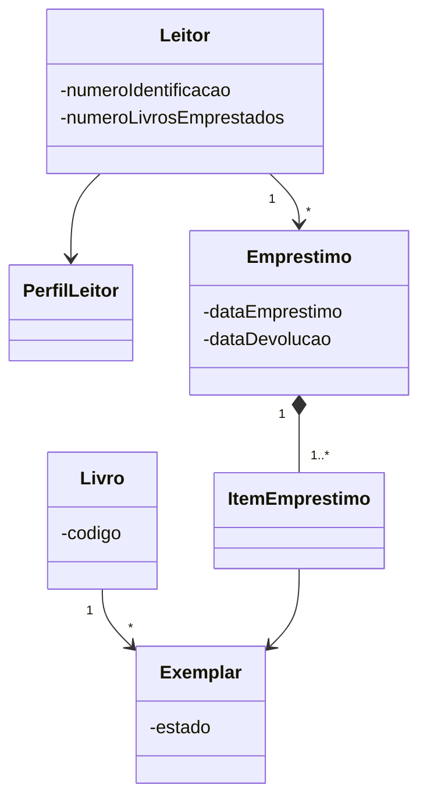

# Aula 04 — Diagrama de Classes

## 1. Contexto da aula

Antes do Diagrama de Classes, a disciplina já havia trabalhado conceitos ligados principalmente à **análise do sistema**, como:

* modelos de processo de software;
* desenvolvimento iterativo e incremental;
* etapas de análise e projeto;
* requisitos de software;
* casos de uso;
* diagramas de sequência;
* diagramas de atividades.

O Diagrama de Classes aparece principalmente na **etapa de projeto**, quando o objetivo passa a ser transformar aquilo que foi identificado durante a análise em uma representação estrutural da solução.

Diagramas para prova: Diagrama de classe, sequencia e caso de uso.

---

# 2. O que é um Diagrama de Classes?

Durante a **análise**, estudamos o problema e o domínio.

Durante o **projeto**, começamos a representar como os conceitos identificados serão estruturados no software.

O Diagrama de Classes é utilizado justamente para criar essa **representação estrutural da solução**. Ele transforma conceitos presentes nos requisitos, histórias do usuário e casos de uso em elementos que poderão existir no software. 

Um Diagrama de Classes representa principalmente:

* **classes**;
* **atributos**;
* **métodos**;
* **relacionamentos entre classes**.

> [!important]
> O foco apresentado na aula é o **domínio de negócio da aplicação**.
>
> Classes mais técnicas ou artificiais, como:
>
> * `Controller`;
> * `Service`;
> * `Repository`;
>
> geralmente não são o objetivo principal desse tipo de diagrama.

Isso significa que, em um sistema bancário, conceitos como:

```text
Cliente
Conta
Banco
Movimentação
Agência
```

são muito mais relevantes para o modelo de domínio do que:

```text
AccountController
AccountRepository
AccountService
```


---

# 3. Estrutura básica de uma classe

Em UML, uma classe normalmente é representada por um retângulo dividido em três partes:

```text
+---------------------------+
|          Account          |
+---------------------------+
| - number: int             |
| - balance: BigDecimal     |
| - state: AccountState     |
+---------------------------+
| + withdraw(amount): void  |
| + deposit(amount): void   |
+---------------------------+
```

As três regiões representam:

1. **nome da classe**;
2. **atributos**;
3. **métodos**.

---

# 4. Classe

Uma classe materializa em software um **conceito pertencente ao domínio da aplicação**.

Exemplo em um domínio bancário:

* `Cliente`;
* `Banco`;
* `Movimentação`;
* `Conta`.

Uma classe não deve ser criada apenas porque encontramos um substantivo no requisito.

Ela deve representar algo relevante que o sistema precise:

* conhecer;
* armazenar;
* manipular;
* consultar;
* ou cujo comportamento precise ser representado.

---

# 5. Atributos

Classes armazenam informações relevantes ao sistema por meio de **atributos**.

Exemplo:

```text
Account
-------------------------
- number: int
- balance: BigDecimal
- availableCreditLimit: BigDecimal
- openingDate: LocalDate
- state: AccountState
```

A sintaxe geral apresentada é:

```text
visibilidade nome: Tipo
```

Exemplo:

```text
- balance: BigDecimal
```

Significa:

* `-` → acesso privado;
* `balance` → nome do atributo;
* `BigDecimal` → tipo.

### Exemplos de atributos por conceito

**Cliente**

```text
nome
cpf
dataNascimento
```

**Banco**

```text
nome
numero
```

**Movimentação**

```text
valor
emissor
favorecido
```

---

# 6. Métodos

Além de armazenar informações, uma classe também representa os **comportamentos** que seus objetos podem executar.

Um método pode possuir:

* nível de acesso;
* nome;
* parâmetros;
* tipo de retorno.

Métodos representam os **comportamentos que pertencem à classe**.

Eles podem:

- **consultar o estado do objeto**, sem modificá-lo;
- **alterar o estado do próprio objeto**;
- executar operações sobre objetos relacionados, quando isso fizer parte da responsabilidade da classe.

A alteração do estado deve respeitar as **regras de negócio e invariantes do objeto**.  
O método não "altera a regra de negócio"; ele **implementa/aplica a regra de negócio** para decidir se e como o estado pode ser modificado.

Exemplo:

```text
+ withdraw(amount: double): void
```

Interpretação:

```text
+             → público
withdraw      → nome do método
amount        → parâmetro
double        → tipo do parâmetro
void          → tipo de retorno
```

Outro exemplo:

```text
# calculateInterest(): BigDecimal
```

Nesse caso:

* o método é `protected`;
* não recebe parâmetros;
* retorna `BigDecimal`.

A aula utiliza, por exemplo:

```text
Cliente
- iterarContas()
- adicionarRestricao()

Agência
- criarConta()
- encerrarConta()
- iterarContas()

Movimentação
- efetivar()
- agendar()
```

A representação de métodos segue a mesma lógica usada na programação: parâmetros são opcionais e existe um tipo de retorno. 


---

# 7. Modificadores de acesso

A UML possui símbolos para indicar a visibilidade dos atributos e métodos.

| Símbolo | Modificador | Acesso                                     |
| ------- | ----------- | ------------------------------------------ |
| `+`     | público     | acessível em toda a aplicação              |
| `#`     | protegido   | acessível às subclasses e dentro do pacote |
| `-`     | privado     | acessível dentro da própria classe         |
| `~`     | pacote      | acessível às classes do mesmo pacote       |

Essas convenções aparecem explicitamente na aula. 

Exemplo:

```text
AbstractClass
--------------------------------
- privateAttribute: Type
# protectedAttribute: Type
+ publicStaticAttribute: Type
~ internalAttribute: Type
```

## Elementos estáticos

Para indicar um atributo ou método **estático**, o elemento deve aparecer **sublinhado**.

Conceitualmente:

```java
public static int count;
```

seria representado como um atributo estático no diagrama.

## Elementos abstratos

Classes e métodos **abstratos** são representados em *itálico*.
Os descendentes tem que implementar.

---

# 8. Relacionamentos entre classes

Uma parte central do Diagrama de Classes é representar **como os conceitos do domínio se relacionam**.

Os principais relacionamentos apresentados são:

* associação;
* tipo associativo;
* dependência;
* agregação;
* composição;
* herança;
* implementação de interface.

---

# 9. Associação

Uma **associação** representa um relacionamento estrutural entre dois objetos.

Exemplo:

```text
Client ---------------- Account
```

No exemplo apresentado:

* um `Client` possui uma ou várias `Account`;
* uma `Account` possui um `Client` chamado `holder`.


Conceitualmente:

```java
class Client {
    List<Account> accounts;
}

class Account {
    Client holder;
}
```

Uma associação pode conter:

* nome da relação;
* direção;
* rótulos;
* cardinalidade/multiplicidade.

---

# 10. Associação bidirecional

Em uma associação bidirecional:

> **A conhece B e B conhece A.**

Exemplo:

```text
Client <--------> Account
```

Em código:

```java
class Client {
    List<Account> accounts;
}

class Account {
    Client holder;
}
```

Os dois objetos conhecem a relação.

---

# 11. Associação unidirecional

Em uma associação unidirecional:

> **A conhece B, mas B não conhece A.**

Exemplo utilizado na aula:

```text
AccountReport -------> Account
```

O relatório conhece as contas utilizadas para produzir o relatório.

Porém:

```text
Account
```

não precisa saber quais relatórios utilizaram aquela conta.

Essa propriedade é chamada de **navegabilidade**.

---

# 12. Navegabilidade

Os relacionamentos podem indicar **qual objeto conhece qual objeto**.

Em uma relação unidirecional:

```text
A -------> B
```

A conhece B.

B não necessariamente conhece A.

Quando nenhum sentido de navegação é explicitamente indicado, a aula considera implícito que todos os envolvidos conhecem o relacionamento.

### Exemplo

```text
AccountReport -----> Account
```

O `AccountReport` conhece as contas.

Uma `Account`, entretanto, não sabe que foi utilizada por determinado relatório.

---

# 13. Tipo associativo

Um **tipo associativo** ocorre quando o próprio relacionamento entre duas entidades contém informações relevantes.

Exemplo apresentado:

```text
Client
   |
   |
Account
```

A relação entre cliente e conta pode gerar algo como:

```text
Transaction
```

contendo:

```text
id
dateTime
amount
status
type
```

Isso é especialmente comum quando:

* existe um atributo relacionado à associação;
* o objeto depende da existência daquela relação;
* existe um relacionamento **muitos-para-muitos** com informações adicionais.

![[Pasted image 20260831090910.png]]

Uma forma comum de enxergar isso em banco de dados seria:

```text
A ---- N : N ---- B
```

transformando a relação em:

```text
A ---- 1:N ---- AssociationEntity ---- N:1 ---- B
```

---

# 14. Dependência

Uma **dependência** representa uma relação conceitual mais fraca.

Nesse caso:

> o estado ou informação de um objeto influencia o comportamento de outro.

Exemplo da aula:

```text
Bank ---> FederalRate
```

![[Pasted image 20260831091515.png|418]]

O banco utiliza uma taxa federal para calcular determinados juros.

```text
FederalRate
- value
- year
- month
```

```text
Bank
+ basicInterest(rate)
+ discountedInterest(rate)
```

O `Bank` utiliza `FederalRate`, mas isso não significa necessariamente que precise armazená-la como parte estrutural permanente do objeto.

Por isso:

> **dependência é estruturalmente mais fraca que associação.**

---

# 15. Associação × Dependência

Essa diferença é importante.

### Associação

Existe uma ligação estrutural entre objetos.

Exemplo:

```java
class Account {
    private Client holder;
}
```

A conta **possui referência** ao cliente.

### Dependência

Um objeto apenas precisa utilizar o outro para realizar alguma operação.

Exemplo conceitual:

```java
class Bank {

    BigDecimal calculateInterest(FederalRate rate) {
        ...
    }
}
```

`FederalRate` é necessário para executar o comportamento, mas não necessariamente precisa fazer parte permanentemente do estado de `Bank`.

> [!tip]
> Uma boa pergunta para diferenciar:
>
> **A precisa guardar B ou apenas utilizar B em determinado comportamento?**

---

# 16. Agregação

A **agregação** representa uma relação:

> **todo-parte**

Porém a parte consegue existir independentemente do todo.

Símbolo:

```text
◇
```

O losango fica no lado do **todo/agregador**.

Exemplo conceitual apresentado:

```text
Carro ◇------ Roda
```

Uma roda pode:

* existir antes do carro;
* ser retirada;
* ser substituída;
* continuar existindo fora daquele carro.

Portanto:

```text
Carro
```

é o todo, mas:

```text
Roda
```

possui ciclo de vida independente.

No exemplo UML da aula:

```text
Bank ◇------ ATM
```
![[Pasted image 20260831101110.png|495]]

---

# 17. Composição

A **composição** também representa uma relação:

> **todo-parte**

Mas é uma relação mais forte que agregação.

Símbolo:

```text
◆
```

Nesse caso:

> a parte não existe independentemente do todo.

A aula utiliza como exemplo conceitual:

```text
Pessoa ◆------ Pernas
```

e no diagrama bancário:

```text
Bank ◆------ Branch
```

A composição indica forte ligação entre os ciclos de vida.
![[Pasted image 20260831101146.png|472]]
Em banco de dados seria uma entidade fraca.
### Comparação

| Relacionamento | Todo-parte | Parte existe sozinha? |
| -------------- | ---------: | --------------------: |
| Agregação      |          ✅ |                     ✅ |
| Composição     |          ✅ |                     ❌ |

---

# 18. Agregação × Composição

Essa é uma das distinções mais importantes da aula.

## Agregação

```text
A ◇------ B
```

B faz parte de A, porém:

```text
B pode existir sem A
```

## Composição

```text
A ◆------ B
```

B faz parte de A e:

```text
B não existe fora do ciclo de vida de A
```

> [!example] Pergunta prática
> Se eu destruir o objeto **A**, faz sentido o objeto **B continuar existindo?**
>
> * **sim** → provavelmente agregação;
> * **não** → provavelmente composição.

---

# 19. Herança

A herança permite criar um conceito especializado a partir de outro conceito mais geral.

Exemplo:

```text
             Account
            /       \
           /         \
CheckingAccount   SavingAccount
```

`Account` é o **supertipo**.

`CheckingAccount` e `SavingAccount` são **subtipos**.

A aula apresenta duas regras importantes.

![[Pasted image 20260831101935.png|491]]

## Regra do “é um”

O subtipo precisa realmente poder ser considerado uma instância do supertipo.

```text
CheckingAccount é uma Account
SavingAccount é uma Account
```

## Regra dos “100%”

O subtipo recebe os:

* relacionamentos;
* atributos;
* comportamentos;

definidos no supertipo.

A herança, portanto, representa uma relação do tipo:

> **“é um”**

Se um método não foi pensado para ser sobrescrito, SEMPRE use final.

---

# 20. Interface

Uma **interface** define um contrato. É tipo uma herança só que mais fraco.

Exemplo:

```text
<<interface>>
Discounted
-------------------------------
+ applyDiscount(amount): void
+ extendDiscount(days): void
```
![[Pasted image 20260831103632.png|373]]

Uma classe que implementa essa interface deve fornecer os comportamentos definidos por ela.

Interfaces permitem que outras classes dependam de uma **abstração**, e não necessariamente de uma implementação concreta.

A aula resume essa relação como:

> herança → **“é um”**

e implementação de interface → **“se comporta como um”**. 

---

# 21. Resumo dos principais relacionamentos

| Relacionamento           | Significado                                          |
| ------------------------ | ---------------------------------------------------- |
| Associação bidirecional  | A conhece B e B conhece A                            |
| Associação unidirecional | A conhece B, mas B não conhece A                     |
| Dependência              | A utiliza informações/comportamentos de B            |
| Agregação                | B faz parte de A, mas pode existir sem A             |
| Composição               | B faz parte de A e não existe independentemente de A |
| Herança                  | A **é um** B                                         |
| Interface                | A **se comporta como** determinado contrato          |
![[Pasted image 20260831103719.png|500]]
---

# 22. Multiplicidade

A multiplicidade determina **quantos objetos podem participar de um relacionamento**.

Os principais valores apresentados são: 

| Multiplicidade | Significado                        |
| -------------- | ---------------------------------- |
| `0..1`         | zero ou um                         |
| `0..*`         | zero ou muitos                     |
| `1..*`         | um ou muitos                       |
| `n`            | quantidade específica              |
| `m,n,p`        | quantidades específicas permitidas |
| `m..n`         | intervalo de valores               |

Também é comum:

```text
1
```

significar **exatamente um**.

![[Pasted image 20260831104637.png|615]]

---

## Exemplo: Cliente e Conta

```text
Client 1 -------- 1..* Account
```

Pode representar:

* cada conta pertence a exatamente **1 cliente**;
* cada cliente possui **1 ou mais contas**.

---

# 23. Como identificar classes a partir da análise

Uma das partes mais importantes da aula é mostrar como sair de um:

```text
requisito / história / caso de uso
```

para um:

```text
modelo de classes
```

Requisitos, histórias e casos de uso servem como fonte para descobrir conceitos relevantes do domínio.

Além disso, o processo funciona nos dois sentidos:

```text
Requisitos → ajudam a criar → Modelo de domínio

Modelo de domínio → ajuda a melhorar → Vocabulário dos requisitos
```

Isso ajuda a estabelecer uma **linguagem comum** entre desenvolvedores e clientes.

O Diagrama de Classes também não deve ser considerado imutável: ele evolui juntamente com a compreensão do domínio.

---

# 24. Exemplo utilizado: empréstimo de livros

A aula utiliza um caso de uso de biblioteca.

Fluxo principal:

1. o leitor apresenta sua carteirinha e os livros ao atendente;
2. o atendente informa a identificação do leitor ao sistema;
3. o atendente informa os códigos dos livros;
4. a data de devolução é calculada a partir do perfil do leitor;
5. uma transação de empréstimo é criada;
6. os livros passam para o estado `emprestado`;
7. o número de livros emprestados pelo leitor é incrementado;
8. os dados da transação são disponibilizados ao atendente.

A partir desse texto começa o processo de descoberta das classes.

---

# 25. Passo 1 — Identificar substantivos

Primeiro devem ser isolados os substantivos presentes na especificação.

Foram encontrados candidatos como:

```text
Leitor
Carteirinha
Biblioteca
Atendente
Livro
Transação de empréstimo
Aluno de graduação
Aluno de pós-graduação
Docente
Sistema
Data de devolução
Perfil do leitor
Número de identificação
Estado do livro
Número de livros
Código do livro
Dados da transação
```

> [!warning]
> **Substantivo encontrado ≠ classe automaticamente.**

Essa primeira lista contém apenas **candidatos**.

---

# 26. Passo 2 — Analisar cada candidato

Cada substantivo deve ser analisado.

Pergunta principal:

> Este conceito representa algo relevante para o domínio que o sistema precisa lembrar?

O conceito pode:

* representar algo;
* saber algo;
* realizar algo;
* possuir estado relevante.

Devemos eliminar candidatos que:

* estão fora do escopo;
* são sinônimos de outro conceito;
* representam apenas propriedades de outras classes.

Por exemplo:

```text
Número de identificação
```

provavelmente não precisa ser uma classe.

Pode simplesmente ser:

```text
Leitor
- numeroIdentificacao
```

Da mesma forma:

```text
Código do livro
```

pode ser um atributo de `Livro` ou `Exemplar`.

---

# 27. Passo 3 — Analisar verbos

Além dos substantivos, a aula recomenda procurar **verbos que possam representar conceitos relevantes**.

Principalmente ações que correspondem a:

* eventos;
* transações;
* acontecimentos que precisam ser registrados.

Exemplo:

```text
emprestar
```

pode levar ao conceito:

```text
Empréstimo
```

Em vez de enxergar apenas:

```text
Leitor empresta Livro
```

podemos perceber que **Empréstimo** é um conceito importante por possuir informações próprias.

Por exemplo:

```text
Emprestimo
- dataEmprestimo
- dataDevolucao
- status
```

---

# 28. Passo 4 — Procurar conceitos implícitos

Nem todos os conceitos importantes aparecem explicitamente no requisito.

É necessário observar se algum conceito identificado é composto por outros conceitos relevantes.

A aula apresenta dois exemplos importantes.

## Empréstimo e Item de Empréstimo

Um empréstimo pode conter vários livros.

Então pode ser necessário introduzir:

```text
Emprestimo
    |
    | 1..*
    |
ItemEmprestimo
```

Cada item representa uma ocorrência específica dentro daquele empréstimo.

## Livro e Exemplar

`Livro` pode representar a **obra**.

Entretanto, uma biblioteca possui diversas cópias físicas dessa obra.

Assim:

```text
Livro
```

e:

```text
Exemplar
```

podem ser conceitos diferentes.

Exemplo:

```text
Livro: Clean Code

Exemplar #1
Exemplar #2
Exemplar #3
```

O que é efetivamente emprestado é o **Exemplar**, e não a abstração `Livro`.

---

# 29. Passo 5 — Checklist para descobrir classes

Após a análise inicial, a aula sugere procurar sistematicamente por:

* objetos físicos ou tangíveis;
* categorias ou catálogos;
* lugares;
* transações; parte mais importante guarda preferencias do user
* itens de transações;
* eventos relacionados às transações;
* papéis desempenhados por pessoas;
* contêineres;
* elementos contidos nesses contêineres.

Isso funciona como um checklist caso algum conceito relevante tenha passado despercebido.

---

# 30. Identificando relacionamentos

Depois de descobrir as classes, precisamos determinar **como elas se relacionam**.

A aula sugere três verificações principais.

## Passo 1 — Um conceito faz parte do outro?

Perguntar:

> A é física ou logicamente parte de B?

Exemplos:

```text
Livro → Estante
```

Um livro pode estar fisicamente armazenado em uma estante.

```text
ItemEmprestimo → Emprestimo
```

Um item é logicamente parte de um empréstimo.

---

## Passo 2 — Um conceito descreve ou qualifica o outro?

Perguntar:

> A serve para classificar ou descrever B?

Exemplos:

```text
Livro ↔ Categoria
Livro ↔ Autor
```

---

## Passo 3 — Um objeto precisa conhecer outro?

Perguntar:

> A precisa conhecer B ou solicitar comportamentos de B?

Exemplo:

```text
Emprestimo → Leitor
```

O empréstimo precisa saber **qual leitor retirou o exemplar**.

Outro exemplo:

```text
Emprestimo → TipoLeitor
```

porque o tipo do leitor influencia o cálculo da data de devolução.

> [!warning]
> A aula destaca que adicionar associações demais produz:
>
> * diagramas difíceis de ler;
> * modelos confusos;
> * maior acoplamento entre objetos.

---

# 31. Identificando atributos

Depois de identificar as classes, podemos voltar para a lista inicial de substantivos.

Os conceitos que **não se tornaram classes** podem ser candidatos a atributos.

Exemplo:

```text
Leitor
- numeroIdentificacao
```

```text
Livro
- codigo
- estado
```

```text
Emprestimo
- dataDevolucao
```

Mas apenas atributos realmente relevantes para o domínio devem ser adicionados.

> [!important]
> Nem toda característica existente no mundo real precisa existir no software.

A aula recomenda consultar o **especialista de domínio** para saber quais informações realmente importam.

Atributos desnecessários aumentam a complexidade do modelo.

---

# 32. Identificando métodos

Para identificar métodos, devemos procurar comportamentos que os objetos precisam fornecer.

A aula propõe observar quatro situações principais:

### 1. Consultas baseadas no próprio estado

Exemplo:

```text
Account
+ hasAvailableCredit(): boolean
```

O objeto consegue responder utilizando seus próprios atributos.

---

### 2. Consultas utilizando objetos relacionados

Exemplo conceitual:

```text
Client
+ activeAccounts(): List<Account>
```

O cliente consulta suas contas relacionadas.

---

### 3. Operações que alteram o próprio estado

Exemplo:

```text
Account
+ deposit(amount): void
+ withdraw(amount): void
```

---

### 4. Operações que alteram objetos relacionados ou partes do objeto

Um objeto também pode disponibilizar comportamentos capazes de manipular elementos relacionados.

---

## O que pode ser omitido

Para não poluir o diagrama, a aula diz que normalmente podem ser omitidos:

* construtores;
* getters comuns;
* setters comuns;
* métodos auxiliares privados.

O objetivo é manter a **legibilidade do modelo**, e não reproduzir cada linha que existirá no código.

---

# 33. Processo completo para construir um Diagrama de Classes

Uma forma de condensar toda a metodologia da aula é:

```text
Requisitos / Histórias / Casos de Uso
              ↓
      Identificar substantivos
              ↓
       Criar candidatos
              ↓
      Eliminar falsos candidatos
              ↓
        Identificar verbos
              ↓
   Descobrir conceitos implícitos
              ↓
       Definir as classes
              ↓
      Identificar atributos
              ↓
       Identificar métodos
              ↓
   Identificar relacionamentos
              ↓
 Definir navegabilidade e multiplicidade
              ↓
        Refinar o modelo
```

---

# 34. Perguntas úteis durante a modelagem

### Para descobrir classes

```text
Esse conceito precisa ser lembrado pelo sistema?
Possui informações próprias?
Possui comportamento próprio?
É relevante ao domínio?
```

### Para descobrir atributos

```text
É uma propriedade de algum conceito existente?
Precisa ser armazenado?
É relevante para as regras de negócio?
```

### Para descobrir métodos

```text
O que esse objeto sabe responder?
O que esse objeto pode fazer?
Que estado ele pode modificar?
```

### Para descobrir relações

```text
A contém B?
A conhece B?
A precisa utilizar B?
A é um B?
B pode existir sem A?
Quantos B podem estar relacionados com A?
```

---

# 35. Associação × Agregação × Composição × Dependência

Uma comparação útil para revisão:

| Tipo        | Pergunta                                          |
| ----------- | ------------------------------------------------- |
| Associação  | A conhece/possui relação estrutural com B?        |
| Dependência | A apenas precisa utilizar B?                      |
| Agregação   | B faz parte de A, mas existe sem A?               |
| Composição  | B faz parte de A e depende do ciclo de vida de A? |
| Herança     | A realmente **é um** B?                           |

---

# 36. Exemplo resumido — domínio de biblioteca

A partir dos conceitos utilizados na aula, um modelo conceitual possível poderia envolver:

```text
Leitor
Livro
Exemplar
Emprestimo
ItemEmprestimo
PerfilLeitor
```

Uma representação simplificada:



> [!note]
> Esse trecho serve como **reconstrução didática** dos conceitos discutidos na aula. O próprio exercício pede que o aluno proponha o modelo final, portanto o material não fornece uma única resposta pronta.

---

# 37. Resumo central da aula

Os pontos fundamentais são: 

* o Diagrama de Classes é utilizado na **fase de projeto** para representar a estrutura do sistema;
* seus principais elementos são:

  * classes;
  * atributos;
  * métodos;
  * relacionamentos;
* associação representa uma relação estrutural;
* dependência representa uma relação mais fraca;
* herança representa uma relação **“é um”**;
* implementação de interface representa algo que **“se comporta como”** determinada abstração;
* agregação representa uma relação todo-parte com ciclos de vida independentes;
* composição representa uma relação todo-parte forte;
* as classes podem ser identificadas a partir dos artefatos produzidos durante a análise.

---

# 38. Exercícios propostos

## Exercício 1 — Biblioteca

A partir do caso de uso **Emprestar Livros**, deve-se propor um Diagrama de Classes contendo:

* classes;
* atributos;
* métodos;
* relacionamentos adequados.


---

## Exercício 2 — ENADE 2014: comércio eletrônico

O segundo exercício apresenta um sistema de e-commerce.

O domínio possui elementos como:

```text
Produto
Categoria
Cliente
Pedido
Pagamento
NotaFiscal
```

Existem produtos de diversas categorias e diferentes formas de pagamento.

Cada produto possui:

* descrição;
* preço;
* quantidade em estoque;
* categoria.

Clientes possuem:

* nome;
* endereço;
* e-mail.

Há ainda dois tipos de cliente:

```text
ClienteCorporativo → CNPJ
ClienteIndividual → CPF
```

O cliente realiza pedidos e escolhe uma forma de pagamento. Depois da confirmação, os itens são entregues e uma nota fiscal eletrônica é enviada. O sistema também precisa preservar o preço praticado **na data da compra**, pois o preço atual do produto pode mudar. 

O exercício solicita um Diagrama de Classes contendo:

* nomes das classes;
* métodos candidatos;
* atributos;
* relacionamentos;
* cardinalidades;
* pelo menos uma **generalização/herança**;
* pelo menos uma **composição**. 

---

# 39. Cheat sheet UML

```text
VISIBILIDADE

+ público
- privado
# protegido
~ pacote


MULTIPLICIDADE

0..1   zero ou um
1      exatamente um
0..*   zero ou muitos
1..*   um ou muitos
m..n   intervalo


RELACIONAMENTOS

A -------- B      Associação
A -------> B      Associação unidirecional
A - - - -> B      Dependência
A ◇------- B      Agregação
A ◆------- B      Composição
A --------▷ B     Herança/generalização
```

---

# 40. O que mais vale memorizar para prova

> [!summary] Essencial
> **Diagrama de Classes = representação estrutural do domínio na etapa de projeto.**

### Classe

```text
conceito relevante do domínio
```

### Atributo

```text
informação que o objeto precisa armazenar
```

### Método

```text
comportamento que o objeto fornece
```

### Associação

```text
A possui/conhece B
```

### Dependência

```text
A utiliza B
```

### Agregação

```text
B faz parte de A
mas B vive sem A
```

### Composição

```text
B faz parte de A
e B não vive sem A
```

### Herança

```text
A é um B
```

### Interface

```text
A implementa um contrato
```

### Multiplicidade

```text
quantos objetos podem participar da relação?
```

### Regra mais importante ao extrair classes

```text
Substantivo ≠ automaticamente uma classe.
```

É preciso analisar se aquele conceito realmente representa algo relevante para o **domínio do sistema**.
