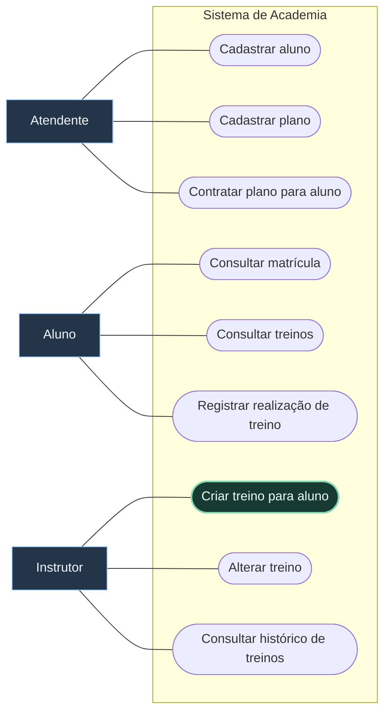
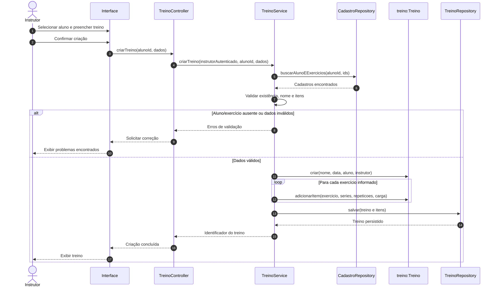
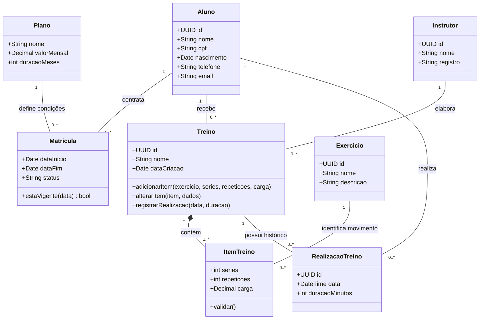

## Enunciado

Uma academia deseja informatizar o gerenciamento de seus alunos, planos e treinos. O sistema será utilizado por **alunos**, **instrutores** e **atendentes**.

> [!tip] Nível 1 — Fundamentos
> Resolva as quatro partes antes de consultar o gabarito ao final. O foco é distinguir o exercício do catálogo da sua prescrição em um treino.

### Requisitos

| Código | Requisito funcional |
| --- | --- |
| RF01 | O atendente pode cadastrar novos alunos. |
| RF02 | O cadastro registra nome, CPF, data de nascimento, telefone e e-mail. |
| RF03 | O atendente pode cadastrar planos com nome, valor mensal e duração. |
| RF04 | O atendente pode associar um plano a um aluno. |
| RF05 | A contratação registra início e término da matrícula. |
| RF06 | O aluno pode consultar os dados de sua matrícula. |
| RF07 | O aluno pode consultar seus treinos. |
| RF08 | O instrutor pode criar um treino para um aluno. |
| RF09 | Um treino possui nome, data de criação e uma lista de exercícios. |
| RF10 | Cada exercício do treino possui nome, séries, repetições e carga recomendada. |
| RF11 | O instrutor pode alterar os exercícios de um treino existente. |
| RF12 | O aluno pode registrar a realização de um treino. |
| RF13 | O registro da realização armazena data e duração. |
| RF14 | O instrutor pode consultar o histórico de treinos realizados por um aluno. |

### Parte A — Casos de uso do sistema inteiro

Identifique atores, objetivos e associações. Avalie se existem comportamentos que justificam `«include»` ou `«extend»`; não é obrigatório usar essas relações.

### Parte B — Especificação textual

Especifique **Criar treino para aluno**, incluindo nome, objetivo, atores, pré-condições, pós-condições, fluxo principal, alternativas e exceções.

Considere aluno existente, instrutor autenticado, pelo menos um exercício por treino e séries e repetições maiores que zero.

### Parte C — Sequência

Modele **Criar treino para aluno**. Distribua responsabilidades entre interface, controller, service, repositories e entidades, conforme necessário. O ator não acessa diretamente o banco.

Avalie mensagens como `selecionarAluno()`, `buscarAluno()`, `criarTreino()`, `adicionarExercicio()` e `salvarTreino()`.

### Parte D — Classes

Inclua atributos, métodos, associações, multiplicidades e composição quando adequada. Decida:

- A quem pertence o treino e quem o elabora?
- Onde ficam séries, repetições e carga?
- Um exercício representa um movimento do catálogo ou sua aplicação em um treino?
- Como relacionar aluno, matrícula e plano?
- Como representar o histórico de realizações?

### Antes de consultar a resolução

- [ ] Cada caso de uso expressa um objetivo do ator.
- [ ] Pré-condições, fluxo e pós-condições são coerentes.
- [ ] A sequência mostra validação e persistência.
- [ ] Todas as associações têm multiplicidades justificadas.
- [ ] O mesmo exercício pode ter cargas diferentes em treinos diferentes.

---

## Resolução comentada

Este é um **gabarito-modelo**, não a única solução válida. Os diagramas de casos de uso abaixo usam uma representação adaptada em Mermaid: atores em caixas, objetivos arredondados e limite do sistema. As linhas contínuas representam participação, não ordem de execução.

### A — Diagrama de casos de uso

Adicionar exercícios é um passo de criar ou alterar treino. Poderia ser extraído como comportamento incluído se houvesse motivo para reutilizá-lo, mas não é preciso transformar cada passo em caso de uso. Calcular o término da matrícula é uma regra interna.

### B — Caso de uso: Criar treino para aluno

| Campo | Especificação |
| --- | --- |
| Objetivo | Disponibilizar ao aluno um treino prescrito por um instrutor. |
| Ator principal | Instrutor. |
| Pré-condições | Instrutor autenticado; aluno cadastrado. |
| Pós-condições de sucesso | Treino persistido, associado ao aluno e ao instrutor, com pelo menos um item válido. |
| Garantia em falha | Nenhum treino incompleto é persistido. |

**Fluxo principal**

1. O instrutor solicita a criação de um treino.
2. O sistema apresenta a seleção de alunos.
3. O instrutor seleciona o aluno; o sistema verifica sua existência.
4. O instrutor informa o nome do treino.
5. O instrutor seleciona um exercício e informa séries, repetições e carga.
6. O instrutor repete o passo 5 até completar a prescrição.
7. O instrutor confirma a criação.
8. O sistema valida o nome, a existência de itens e os valores informados.
9. O sistema cria o treino, registra a data e associa aluno, instrutor e itens.
10. O sistema salva o conjunto e apresenta a confirmação.

| Tipo | Ponto | Comportamento |
| --- | --- | --- |
| Alternativa: vários exercícios | 6 | Repetir a inclusão; cada ocorrência gera um item de treino. |
| Alternativa: desistência | Antes de 7 | Descartar o formulário sem criar treino. |
| Exceção: aluno inexistente | 3 ou revalidação em 8 | Informar o erro e solicitar outra seleção. |
| Exceção: nenhum exercício | 8 | Solicitar pelo menos um exercício e voltar à edição. |
| Exceção: séries/repetições ≤ 0 | 8 | Identificar o item inválido e solicitar correção. |
| Exceção: exercício inexistente | 8 | Solicitar um exercício válido do catálogo. |
| Exceção: falha ao salvar | 10 | Não confirmar sucesso nem deixar itens parcialmente gravados. |

### C — Diagrama de sequência

Para manter a leitura compacta, `CadastroRepository` reúne as consultas de alunos e exercícios. Essa é uma escolha didática; repositories separados também são válidos.

O service coordena as consultas e a gravação. A entidade protege suas invariantes, como séries e repetições positivas. A sequência mostra sucesso e erros de validação; uma falha de persistência segue a exceção descrita na especificação.

### D — Diagrama de classes

> [!important] O item pertence ao treino
> `Exercicio` identifica o movimento; `ItemTreino` guarda a prescrição. A composição indica que o item pertence exclusivamente ao treino. O exercício do catálogo pode ser reutilizado.

| Exercício | Treino | Séries × repetições | Carga |
| --- | --- | --- | --- |
| Supino | A | 3 × 10 | 60 kg |
| Supino | B | 4 × 6 | 80 kg |

`RealizacaoTreino` registra cada execução, sem sobrescrever as anteriores. O aluno da realização deve ser o dono do treino. A duração do plano foi expressa em meses como **hipótese do modelo**, pois o enunciado não define a unidade.

### Confira seu gabarito

- Matrícula liga aluno e plano, com início e término.
- Treino tem pelo menos um item; cada item se refere a um exercício.
- A criação associa o instrutor autenticado, sem aceitar uma identidade arbitrária enviada pela tela.
- Não foi necessário inventar herança nem agregação.

**Próximo:** [[2. Clínica Médica|Exercício 2 — Clínica Médica]].
