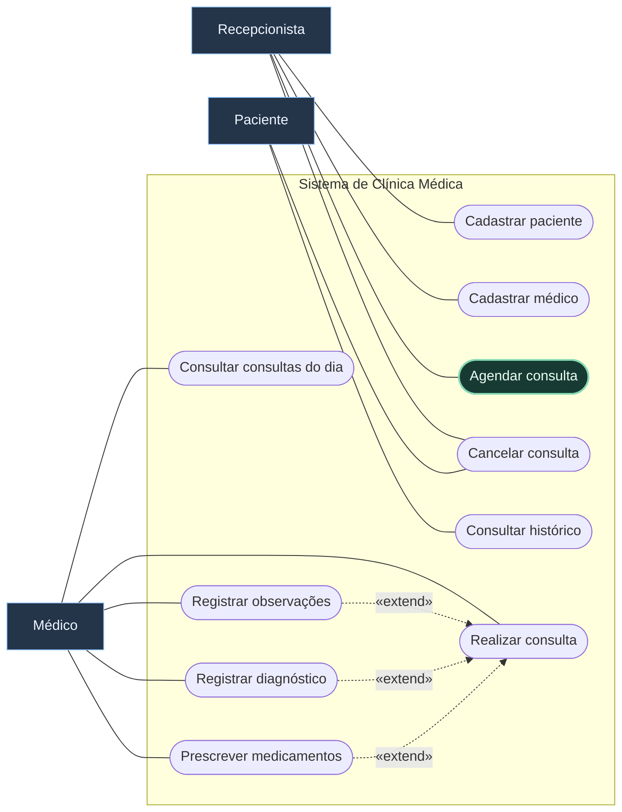
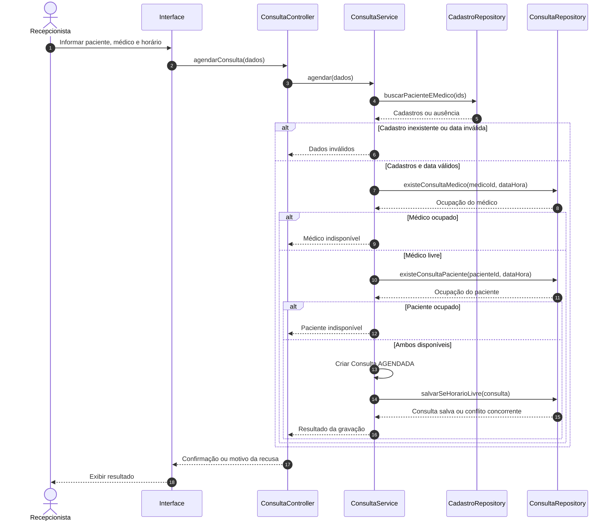
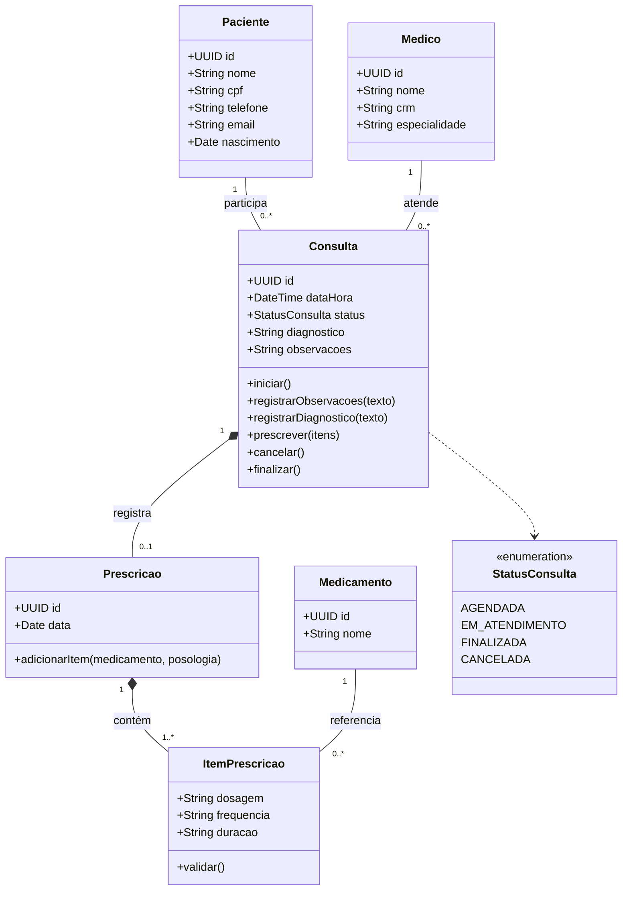

## Enunciado

Uma clínica possui **médicos**, **pacientes** e **recepcionistas**. Ela deseja um sistema para controlar consultas.

> [!tip] Nível 2 — Validações e comportamentos opcionais
> Faça as quatro partes antes de consultar a resolução. Nem todo comportamento precisa virar `«include»` ou `«extend»`.

### Requisitos

| Código | Requisito funcional |
| --- | --- |
| RF01 | A recepcionista pode cadastrar pacientes. |
| RF02 | O paciente possui nome, CPF, telefone, e-mail e data de nascimento. |
| RF03 | A recepcionista pode cadastrar médicos. |
| RF04 | O médico possui nome, CRM e especialidade. |
| RF05 | A recepcionista pode agendar uma consulta para um paciente. |
| RF06 | O agendamento seleciona paciente, médico, data e horário. |
| RF07 | Não pode haver duas consultas para o mesmo médico no mesmo horário. |
| RF08 | Não pode haver duas consultas para o mesmo paciente no mesmo horário. |
| RF09 | O paciente pode cancelar uma consulta. |
| RF10 | A recepcionista também pode cancelar uma consulta. |
| RF11 | Só é possível cancelar uma consulta ainda não realizada. |
| RF12 | O médico pode visualizar suas consultas do dia. |
| RF13 | O médico pode iniciar uma consulta. |
| RF14 | Durante a consulta, o médico pode registrar observações. |
| RF15 | Durante a consulta, o médico pode registrar um diagnóstico. |
| RF16 | Durante a consulta, o médico pode prescrever medicamentos. |
| RF17 | Cada medicamento prescrito possui nome, dosagem, frequência e duração. |
| RF18 | Após finalizar uma consulta, ela não pode mais ser alterada. |
| RF19 | O paciente pode consultar seu histórico de consultas. |

### Parte A — Casos de uso do sistema inteiro

Represente todos os atores e objetivos. Decida como representar registrar observações, registrar diagnóstico e prescrever medicamentos em relação a **Realizar consulta**. Justifique relações de inclusão, extensão ou casos independentes.

### Parte B — Especificação textual

Especifique **Agendar consulta**, com objetivo, atores, pré-condições, pós-condições, fluxo principal, alternativas e exceções. Inclua horário disponível, médico ocupado, paciente ocupado e paciente ou médico inexistente.

### Parte C — Sequência

Modele **Agendar consulta**, mostrando explicitamente as consultas aos cadastros e as duas verificações de conflito. Distribua responsabilidades entre interface, controller, service e repositories.

### Parte D — Classes

Modele paciente, médico, consulta e prescrição, com atributos, métodos e multiplicidades. Decida onde representar os dados de **Amoxicilina, 500 mg, a cada 8 horas, por 7 dias**: no medicamento genérico ou em um item específico de prescrição?

### Antes de consultar a resolução

- [ ] Verifiquei a disponibilidade do médico e do paciente.
- [ ] O caso base faz sentido sem suas extensões opcionais.
- [ ] O modelo representa a imutabilidade de uma consulta finalizada como regra.
- [ ] Uma prescrição pode conter mais de um medicamento.
- [ ] O ator não acessa diretamente o banco de dados.

---

## Resolução comentada

Este é um gabarito possível. O primeiro diagrama usa **notação adaptada em Mermaid**: caixas para atores, formas arredondadas para casos de uso e um contorno para o sistema. Associações não indicam sequência temporal.

### A — Diagrama de casos de uso

**Realizar consulta** abrange iniciar e finalizar o atendimento. As extensões ocorrem no ponto **durante o atendimento**, se o médico optar por registrar a informação correspondente. A seta de extensão aponta do comportamento opcional para o caso base. Também seria válido descrever essas ações apenas no fluxo textual, desde que os requisitos fossem preservados.

### B — Caso de uso: Agendar consulta

| Campo | Especificação |
| --- | --- |
| Objetivo | Reservar um horário de atendimento para um paciente com um médico. |
| Ator principal | Recepcionista. |
| Pré-condições | Recepcionista autenticada; paciente e médico cadastrados. |
| Pós-condições de sucesso | Consulta salva com paciente, médico, data, horário e estado AGENDADA. |
| Garantia em falha | Nenhuma consulta conflitante é criada. |

**Fluxo principal**

1. A recepcionista solicita um agendamento.
2. O sistema solicita paciente, médico, data e horário.
3. A recepcionista informa os dados.
4. O sistema verifica a existência do paciente e do médico.
5. O sistema verifica se o médico possui consulta naquele horário.
6. O sistema verifica se o paciente possui consulta naquele horário.
7. O sistema cria a consulta no estado `AGENDADA`.
8. O sistema persiste a consulta sem permitir que outro agendamento ocupe o mesmo horário simultaneamente.
9. O sistema apresenta a confirmação.

| Tipo | Ponto | Comportamento |
| --- | --- | --- |
| Alternativa: médico ocupado | 5 | Informar indisponibilidade e voltar ao passo 3. |
| Alternativa: paciente ocupado | 6 | Informar conflito e voltar ao passo 3. |
| Alternativa: desistência | Antes de 8 | Encerrar sem registrar consulta. |
| Exceção: cadastro inexistente | 4 | Informar qual cadastro não foi encontrado e solicitar nova seleção. |
| Exceção: dados de data/horário inválidos | 4 | Solicitar correção antes de consultar a agenda. |
| Exceção: conflito concorrente | 8 | Recusar a gravação e solicitar outro horário. |
| Exceção: falha de persistência | 8 | Informar falha sem apresentar confirmação. |

Revalidar os cadastros continua necessário mesmo com a pré-condição: a seleção pode estar desatualizada. **Hipóteses do modelo:** consultas canceladas liberam o horário; o conflito compara o mesmo instante inicial, pois não foi informada uma duração de atendimento.

### C — Diagrama de sequência

`CadastroRepository` resume a consulta aos dois cadastros para reduzir a largura do diagrama.

As verificações explicam os conflitos, mas a persistência também precisa preservar a exclusividade do horário. Duas requisições podem passar pela consulta de disponibilidade antes de qualquer uma gravar.

### D — Diagrama de classes

| Conceito | Exemplo |
| --- | --- |
| Medicamento | Amoxicilina |
| Item de prescrição | 500 mg, a cada 8 horas, por 7 dias |
| Prescrição | Conjunto dos itens prescritos naquela consulta |

> [!important] Consulta finalizada é imutável
> A regra também impede alterações indiretas na prescrição e em seus itens. Uma multiplicidade não expressa essa restrição; os métodos devem verificá-la.

Nesta solução, uma consulta tem **zero ou uma prescrição**, com um ou mais itens quando existente. Trata-se de uma escolha de modelagem; permitir várias prescrições exige ajustar a multiplicidade e os fluxos. O cancelamento foi restrito a `AGENDADA`, interpretando o início do atendimento como o começo da realização.

### Confira seu gabarito

- A seta `«extend»` chega a **Realizar consulta**, nunca no sentido contrário.
- Prescrever é opcional, mas uma prescrição existente não é vazia.
- Dosagem, frequência e duração pertencem ao item, não ao catálogo de medicamentos.
- Conflito de paciente e conflito de médico são tratados separadamente.

**Anterior:** [[1. Academia|Academia]] · **Próximo:** [[3. Biblioteca|Biblioteca]].
