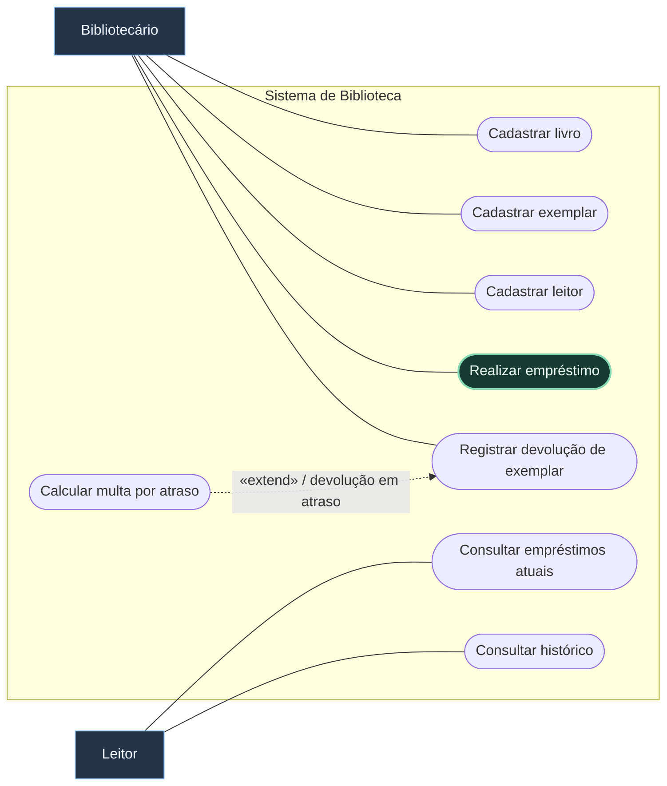
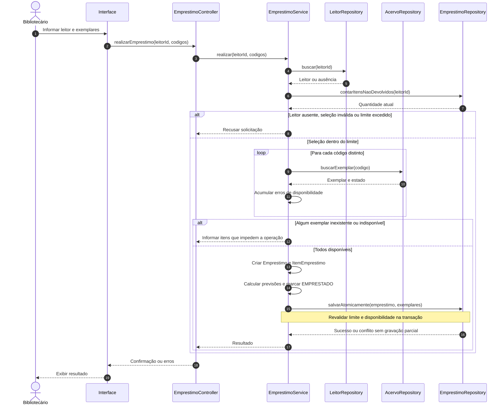
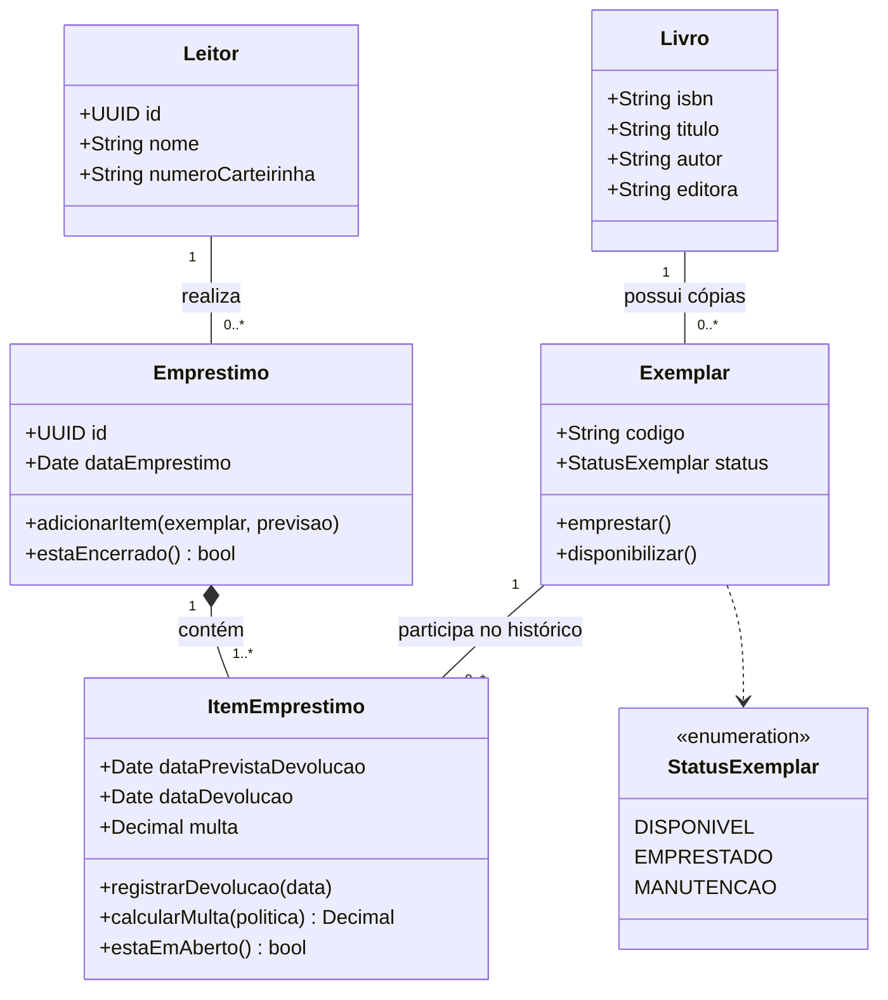

## Enunciado

Uma biblioteca deseja controlar **livros**, **exemplares**, **leitores** e **empréstimos**. O sistema será utilizado por bibliotecários e leitores.

> [!tip] Nível 3 — Multiplicidades e entidade associativa
> Resolva antes de consultar o gabarito. Preste atenção à diferença entre uma obra, sua cópia física e cada ocasião em que essa cópia é emprestada.

### Requisitos

| Código | Requisito funcional |
| --- | --- |
| RF01 | O bibliotecário pode cadastrar livros. |
| RF02 | Um livro possui título, ISBN, autor e editora. |
| RF03 | Um livro pode possuir vários exemplares físicos. |
| RF04 | Cada exemplar possui um código único. |
| RF05 | Um exemplar pode estar DISPONÍVEL, EMPRESTADO ou MANUTENÇÃO. |
| RF06 | O bibliotecário pode cadastrar leitores. |
| RF07 | Um leitor pode ter no máximo cinco exemplares emprestados simultaneamente. |
| RF08 | O bibliotecário pode realizar um empréstimo. |
| RF09 | Um empréstimo possui um ou mais exemplares. |
| RF10 | Todos os exemplares selecionados devem estar disponíveis. |
| RF11 | Ao emprestar, o estado dos exemplares muda para EMPRESTADO. |
| RF12 | O sistema registra a data do empréstimo. |
| RF13 | O sistema calcula a data prevista de devolução. |
| RF14 | O bibliotecário pode registrar a devolução de um exemplar. |
| RF15 | Após a devolução, o exemplar volta a DISPONÍVEL. |
| RF16 | Se houver atraso, o sistema calcula uma multa. |
| RF17 | O leitor pode consultar seus empréstimos atuais. |
| RF18 | O leitor pode consultar seu histórico de empréstimos. |

### Parte A — Casos de uso do sistema inteiro

Modele os objetivos dos dois atores. Considere o cadastro de exemplares e a devolução individual. Avalie se calcular multa justifica uma extensão condicional da devolução.

### Parte B — Especificação textual

Especifique **Realizar empréstimo**: objetivo, atores, pré-condições, pós-condições, fluxo principal, alternativas e exceções. Considere bibliotecário autenticado, leitor e exemplares cadastrados.

Inclua os cenários: leitor já possui cinco exemplares; exemplar indisponível; vários exemplares no mesmo empréstimo. Verifique também o que acontece quando o leitor possui quatro e solicita mais dois.

### Parte C — Sequência

Modele **Realizar empréstimo**. Defina as responsabilidades de `EmprestimoController`, `EmprestimoService`, `LeitorRepository`, `ExemplarRepository` e `EmprestimoRepository`, ou use uma organização equivalente.

### Parte D — Classes

Inclua atributos, métodos e multiplicidades. Pense na relação entre livro e exemplar, leitor e empréstimo, empréstimo e exemplar.

Uma única operação pode resultar em devoluções em dias diferentes:

| Empréstimo nº 10 | Situação |
| --- | --- |
| Exemplar A | Devolvido em 10/09 |
| Exemplar B | Devolvido em 13/09 |
| Exemplar C | Ainda não devolvido |

Descubra onde guardar a data de devolução e a multa de cada exemplar nesse empréstimo.

### Antes de consultar a resolução

- [ ] Contei exemplares em aberto, não apenas registros de empréstimo.
- [ ] Validei a soma dos exemplares atuais com os novos.
- [ ] Modelei a devolução individual.
- [ ] Um exemplar pode aparecer em diferentes empréstimos ao longo do tempo.
- [ ] A gravação não pode deixar parte dos exemplares emprestada em uma operação rejeitada.

---

## Resolução comentada

O gabarito apresenta uma solução possível. No diagrama de casos de uso, a notação Mermaid é **adaptada**: caixas identificam atores e formas arredondadas representam objetivos dentro do limite do sistema.

### A — Diagrama de casos de uso

A extensão ocorre no ponto **avaliar atraso**, dentro da devolução, somente se a data efetiva ultrapassar a prevista. Também seria aceitável deixar o cálculo apenas como regra do fluxo de devolução. Não foi inventado um objetivo separado de “pagar multa”, ausente do enunciado.

### B — Caso de uso: Realizar empréstimo

| Campo | Especificação |
| --- | --- |
| Objetivo | Registrar a retirada de um ou mais exemplares por um leitor. |
| Ator principal | Bibliotecário. |
| Pré-condições | Bibliotecário autenticado; leitor e exemplares cadastrados. |
| Pós-condições de sucesso | Empréstimo e itens persistidos; exemplares EMPRESTADOS; datas de empréstimo e previsão registradas; limite de cinco respeitado. |
| Garantia em falha | Nenhum empréstimo parcial e nenhuma mudança isolada de disponibilidade. |

**Fluxo principal**

1. O bibliotecário solicita um empréstimo e informa o leitor.
2. O sistema verifica o cadastro e consulta a quantidade de exemplares ainda não devolvidos.
3. O bibliotecário seleciona um exemplar.
4. O sistema verifica existência, disponibilidade e ausência de duplicação na seleção.
5. O bibliotecário pode repetir os passos 3 e 4 para incluir outros exemplares.
6. O bibliotecário confirma a seleção.
7. O sistema verifica se há ao menos um exemplar e se `quantidadeAtual + quantidadeSelecionada ≤ 5`.
8. O sistema revalida a disponibilidade e o limite no momento da gravação.
9. O sistema cria o empréstimo, registra a data atual e calcula a previsão conforme a política da biblioteca.
10. O sistema cria um item para cada exemplar e altera os exemplares para `EMPRESTADO`.
11. O sistema persiste todas as alterações em uma única transação e confirma a operação.

| Tipo | Ponto | Comportamento |
| --- | --- | --- |
| Alternativa A: cinco exemplares atuais | 2 | Impedir novo empréstimo e informar o limite. |
| Alternativa B: exemplar indisponível | 4 ou 8 | Informar qual exemplar está indisponível e solicitar outra seleção; não gravar parcialmente. |
| Alternativa C: vários exemplares | 5 | Repetir a seleção, mantendo um item por exemplar distinto. |
| Alternativa: soma superior a cinco | 7 ou 8 | Solicitar a retirada de itens até respeitar o limite. |
| Exceção: leitor/exemplar inexistente | 2 ou 4 | Solicitar um cadastro válido. |
| Exceção: seleção vazia ou duplicada | 4 ou 7 | Solicitar correção, sem criar o empréstimo. |
| Exceção: falha ao persistir | 11 | Reverter a transação e informar a falha. |

> [!example] O limite conta exemplares
> Um empréstimo com quatro itens ainda abertos conta como **quatro exemplares**. Solicitar mais dois deve falhar, mesmo que existam apenas dois registros de empréstimo envolvidos.

### C — Diagrama de sequência

`AcervoRepository` resume a busca dos exemplares. `salvarAtomicamente` persiste empréstimo, itens e estados do acervo juntos; em uma implementação, essa coordenação pode ficar em uma unidade de trabalho.

O `loop` consulta todos os exemplares, mas a criação só acontece se **nenhum** estiver inválido. Alterar objetos em memória não é o mesmo que persistir; em falha, as alterações não podem chegar parcialmente ao armazenamento.

### D — Diagrama de classes

`dataDevolucao` fica ausente enquanto o item está aberto. A composição está entre **Empréstimo e ItemEmprestimo**; cada item tem um único dono. Entre **Livro e Exemplar**, a associação simples evita assumir que apagar o catálogo destrói as cópias e seu histórico. O mínimo zero permite cadastrar um livro antes das cópias físicas.

| Regra | Como é representada |
| --- | --- |
| Devoluções em dias diferentes | Uma data de devolução por ItemEmprestimo. |
| Multas diferentes | Uma multa por ItemEmprestimo. |
| Mesmo exemplar emprestado muitas vezes | Exemplar associado a vários itens históricos. |
| Apenas um empréstimo ativo por exemplar | Restrição: no máximo um item sem devolução por exemplar. |
| Máximo de cinco com o leitor | Soma dos itens sem devolução de todos os seus empréstimos. |

> [!important] O histórico não é uma relação muitos-para-muitos sem atributos
> `ItemEmprestimo` identifica a participação do exemplar em uma operação específica. É nele que ficam previsão, devolução efetiva e multa.

O enunciado não informa prazo nem valor diário da multa. Por isso o modelo usa uma **política da biblioteca**, sem inventar números. Na devolução, registrar a data, calcular eventual multa e liberar o exemplar devem ocorrer juntos.

**Anterior:** [[2. Clínica Médica|Clínica Médica]] · **Próximo:** [[4. Delivery|Delivery]].
