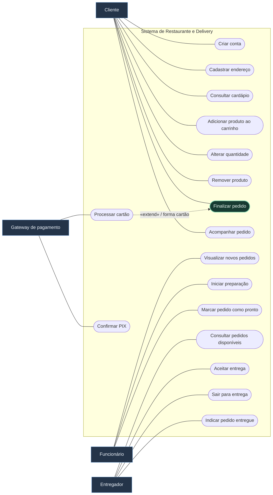
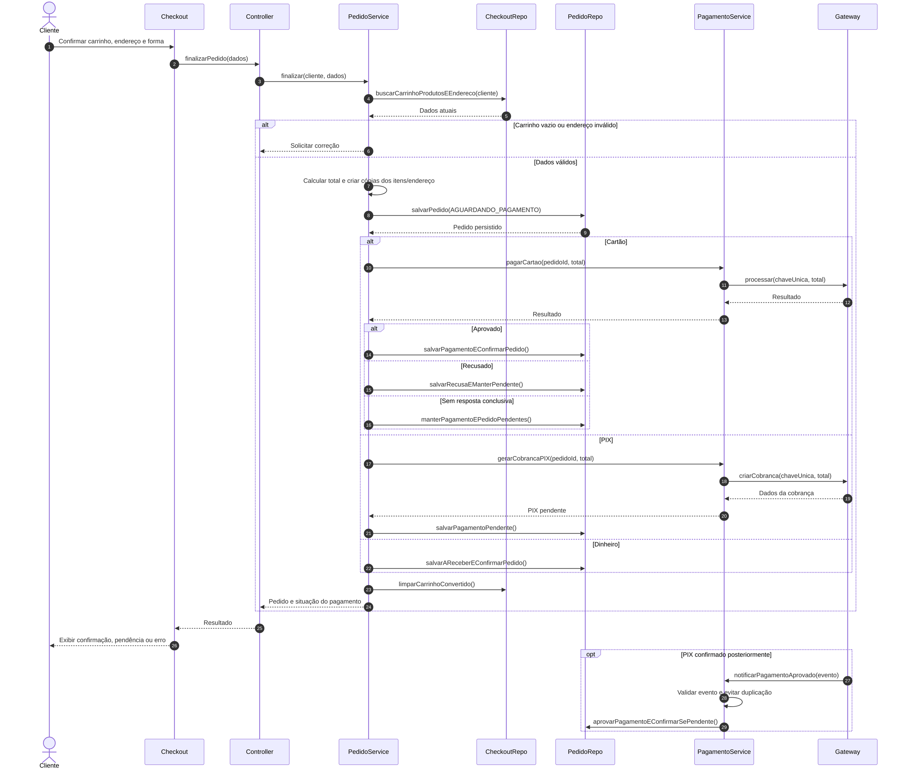
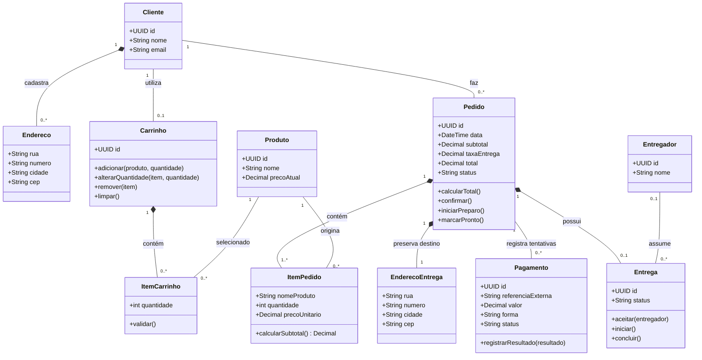

## Enunciado

Um restaurante deseja desenvolver um sistema para pedidos online. Existem **clientes**, **funcionários** e **entregadores**.

> [!tip] Nível 4 — Integrações e caminhos alternativos
> Faça as quatro partes antes do gabarito. Diferencie criação do pedido, confirmação do pagamento e liberação para preparo.

### Requisitos

| Código | Requisito funcional |
| --- | --- |
| RF01 | O cliente pode criar uma conta. |
| RF02 | O cliente pode cadastrar vários endereços. |
| RF03 | O cliente pode consultar o cardápio. |
| RF04 | O cliente pode adicionar produtos ao carrinho. |
| RF05 | O cliente pode alterar a quantidade dos produtos. |
| RF06 | O cliente pode remover produtos do carrinho. |
| RF07 | O cliente pode finalizar o carrinho criando um pedido. |
| RF08 | Um pedido deve possuir pelo menos um produto. |
| RF09 | O cliente deve selecionar um endereço para entrega. |
| RF10 | O sistema calcula o valor total do pedido. |
| RF11 | O sistema calcula a taxa de entrega. |
| RF12 | O cliente escolhe pagamento por PIX, cartão ou dinheiro. |
| RF13 | O PIX deve ser confirmado antes do envio do pedido à cozinha. |
| RF14 | O pagamento por cartão é processado por um serviço externo. |
| RF15 | Pagamento recusado impede a confirmação do pedido. |
| RF16 | O funcionário pode visualizar novos pedidos. |
| RF17 | O funcionário pode iniciar a preparação. |
| RF18 | Após o preparo, o funcionário pode marcar o pedido como pronto. |
| RF19 | Um entregador pode aceitar um pedido disponível para entrega. |
| RF20 | Apenas um entregador pode ficar responsável por cada pedido. |
| RF21 | O entregador pode indicar que saiu para entrega. |
| RF22 | O entregador pode indicar que o pedido foi entregue. |
| RF23 | O cliente pode acompanhar o estado do pedido. |

Os estados possíveis são `AGUARDANDO_PAGAMENTO`, `CONFIRMADO`, `EM_PREPARO`, `PRONTO`, `EM_ENTREGA`, `ENTREGUE` e `CANCELADO`.

### Parte A — Casos de uso do sistema inteiro

Represente os três atores principais e todos os objetivos. Decida se o serviço externo de pagamento deve ser ator e justifique. Não force relações `«include»`/`«extend»` em todos os comportamentos.

### Parte B — Especificação textual

Especifique **Finalizar pedido**, incluindo objetivo, atores, pré-condições, pós-condições, fluxo principal, alternativas e exceções. Cubra:

- pagamento aprovado;
- pagamento recusado;
- carrinho vazio;
- endereço não informado;
- PIX aguardando confirmação.

Considere também como o pagamento em dinheiro afeta o fluxo.

### Parte C — Sequência

Modele **Finalizar pedido** com interface, controller, service, repositories e serviço externo quando necessário. Utilize `alt` para caminhos mutuamente exclusivos e `opt` somente quando houver um comportamento realmente opcional.

### Parte D — Classes

Modele cliente, endereço, produto, carrinho, pedido, pagamento e entrega. Inclua atributos, métodos e multiplicidades. Como representar duas unidades de hambúrguer e três de refrigerante? Como preservar o preço cobrado mesmo depois de uma alteração no cardápio?

### Antes de consultar a resolução

- [ ] Meu carrinho pode existir vazio, mas o pedido não.
- [ ] Quantidade e preço da compra têm um lugar definido.
- [ ] PIX pendente não libera preparo.
- [ ] O serviço externo está fora do limite do sistema.
- [ ] Cada entrega tem no máximo um entregador responsável.

---

## Resolução comentada

O gabarito abaixo explicita escolhas onde o enunciado não detalha a regra. Os casos de uso são desenhados com **notação adaptada em Mermaid**, mantendo atores fora do sistema e objetivos em formas arredondadas.

### A — Diagrama de casos de uso

O gateway é um **ator secundário**, pois pertence a outro sistema. `Processar cartão` estende o checkout no ponto **tratar forma de pagamento**, sob a condição de cartão selecionado. A confirmação posterior de PIX é um caso separado, iniciado pela notificação do gateway, pois ocorre depois do checkout. **Hipótese:** o mesmo provedor também notifica a confirmação do PIX.

Não foi usado `Finalizar pedido «include» Processar cartão`: dinheiro e PIX não percorrem obrigatoriamente o processamento de cartão. Calcular subtotal e taxa permanece no fluxo interno do checkout.

### B — Caso de uso: Finalizar pedido

| Campo | Especificação |
| --- | --- |
| Objetivo | Converter o carrinho em um pedido com itens, destino e pagamento definidos. |
| Ator principal | Cliente. |
| Ator secundário | Gateway de pagamento, quando houver pagamento eletrônico. |
| Pré-condições | Cliente autenticado; carrinho existente e pertencente ao cliente. |
| Sucesso com cartão aprovado | Pedido e pagamento persistidos; pedido CONFIRMADO. |
| Resultado com PIX pendente ou cartão recusado | Pedido persistido em AGUARDANDO_PAGAMENTO. |
| Resultado com dinheiro | Pedido CONFIRMADO e pagamento A_RECEBER, conforme hipótese abaixo. |
| Garantia em dados inválidos | Carrinho vazio ou endereço ausente não gera pedido. |

**Fluxo principal — cartão aprovado**

1. O cliente solicita finalizar o carrinho.
2. O sistema recupera o carrinho e verifica se há itens com quantidades válidas.
3. O cliente seleciona um endereço de entrega.
4. O sistema valida o endereço e calcula subtotal, taxa e total usando os preços vigentes.
5. O cliente escolhe cartão e confirma o total apresentado.
6. O sistema copia itens, preços e endereço para um pedido `AGUARDANDO_PAGAMENTO` e o persiste.
7. O sistema solicita ao gateway o processamento do pagamento, identificado pelo pedido.
8. O gateway informa aprovação.
9. O sistema registra o pagamento aprovado e confirma o pedido.
10. O sistema persiste a atualização, limpa o carrinho convertido e apresenta a confirmação.

| Tipo | Ponto | Comportamento |
| --- | --- | --- |
| Alternativa: carrinho vazio | 2 | Informar o problema e encerrar sem criar pedido. |
| Alternativa: endereço ausente/inválido | 3–4 | Solicitar seleção válida antes de prosseguir. |
| Alternativa: cartão recusado | 8 | Registrar RECUSADO; manter pedido AGUARDANDO_PAGAMENTO e impedir preparo. |
| Alternativa: PIX | 5–8 | Gerar cobrança e apresentar os dados de pagamento; pedido aguarda a confirmação posterior. |
| Alternativa: dinheiro | 5–9 | Registrar A_RECEBER e confirmar o pedido sem chamar o gateway. |
| Exceção: gateway sem resposta conclusiva | 7–8 | Manter pagamento PENDENTE e pedido aguardando; consultar o resultado sem duplicar a cobrança. |
| Exceção: falha ao salvar o pedido | 6 | Não solicitar cobrança; informar falha. |
| Exceção: falha ao salvar retorno aprovado | 9–10 | Reconciliar o retorno pelo identificador da operação, sem cobrar novamente. |

> [!note] Hipóteses explícitas
> Dinheiro será recebido na entrega; por isso permite confirmar antes de receber. O enunciado não define essa regra. Para simplificar, o carrinho é limpo após a conversão persistida, inclusive nos resultados pendentes; novas tentativas usam o pedido existente. A taxa de entrega usa uma política configurada, sem inventar fórmula ou valor.

Na confirmação assíncrona do PIX, o sistema valida a notificação, registra o pagamento aprovado e muda o pedido pendente para `CONFIRMADO`. Notificações repetidas não criam outra cobrança nem outro pedido.

### C — Diagrama de sequência

`CheckoutRepository` resume o acesso a carrinho, produtos e endereço. Os nomes curtos das linhas de vida ajudam a leitura; os papéis estão explícitos.

O fragmento `opt` é posterior à resposta ao cliente: a confirmação do PIX não exige que o navegador permaneça aberto. O fluxo de exceção técnica está detalhado na tabela; uma transação local não torna o gateway externo parte da mesma transação.

### D — Diagrama de classes

> [!important] Carrinho vazio é válido; pedido vazio não
> A multiplicidade do carrinho é `0..*`; a do pedido é `1..*`. `ItemPedido` guarda quantidade, nome e preço no momento da compra. Alterações no produto não reescrevem o histórico.

`EnderecoEntrega` é uma cópia do destino do pedido: editar o endereço do perfil não muda uma entrega já contratada. `Pagamento` representa tentativas, permitindo recusa e nova tentativa sem perder o histórico; só uma quitação do total deve ser aplicada. A referência aos produtos pressupõe preservar seu cadastro histórico.

Uma entrega pode estar sem responsável; depois da aceitação tem exatamente um. A operação `aceitar()` precisa ser exclusiva para impedir dois entregadores de assumirem simultaneamente. Funcionário é um ator; não é obrigatório criar uma classe para todo ator quando não há dados de domínio exigidos.

### Estados e regras de transição

| Estado de origem | Evento/condição | Destino |
| --- | --- | --- |
| AGUARDANDO_PAGAMENTO | Cartão/PIX aprovado ou dinheiro a receber | CONFIRMADO |
| AGUARDANDO_PAGAMENTO | Recusa ou PIX pendente | Permanece aguardando |
| CONFIRMADO | Funcionário inicia preparação | EM_PREPARO |
| EM_PREPARO | Funcionário termina preparo | PRONTO |
| PRONTO | Entregador responsável sai para entrega | EM_ENTREGA |
| EM_ENTREGA | Entregador indica recebimento | ENTREGUE |

`CANCELADO` pertence ao conjunto de estados fornecido, mas o enunciado não define quem pode cancelar nem em quais condições. Essa regra precisa ser esclarecida; não se presume uma permissão de cancelamento para qualquer ator.

**Anterior:** [[3. Biblioteca|Biblioteca]] · **Próximo:** [[5. Hotel|Hotel — simulado final]].
