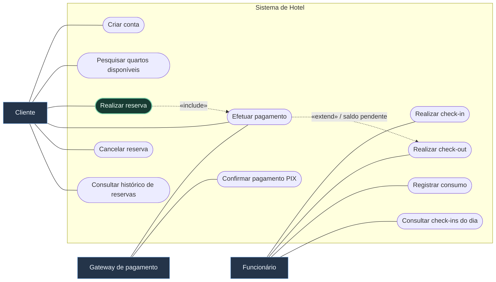
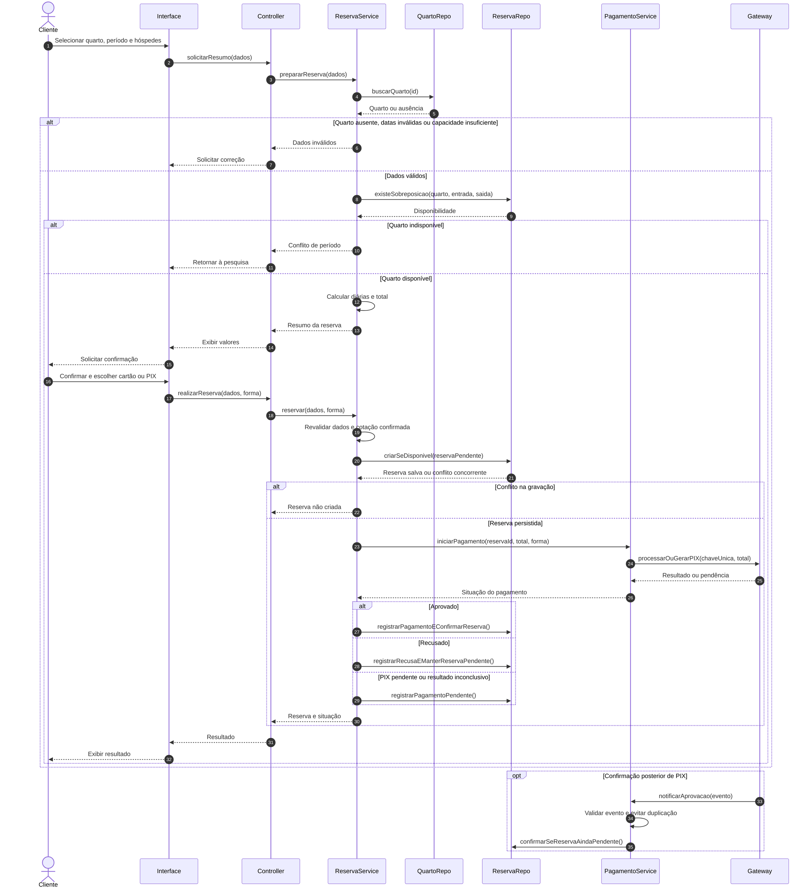
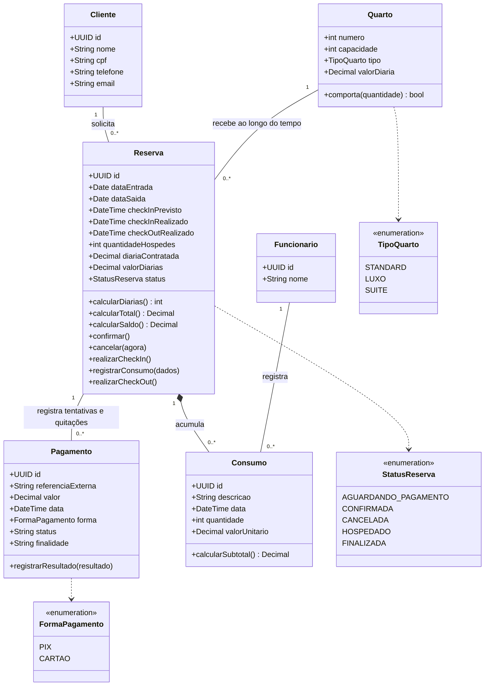

## Enunciado

Um hotel deseja informatizar seu sistema de reservas.

Um **cliente** pode criar uma conta contendo nome, CPF, telefone e e-mail.

O hotel possui vários **quartos**. Cada quarto possui número, capacidade, tipo e valor da diária. Os tipos são `STANDARD`, `LUXO` e `SUÍTE`.

O cliente pode pesquisar quartos disponíveis informando **data de entrada**, **data de saída** e **quantidade de hóspedes**. O sistema deve apresentar somente quartos capazes de acomodar a quantidade informada e que não estejam reservados no período solicitado.

O cliente pode selecionar um quarto e realizar uma **reserva**. Ao reservar, o sistema calcula o número de diárias e o valor total.

O cliente deve realizar um **pagamento** para confirmar a reserva. O pagamento pode ser realizado com cartão ou PIX. Se aprovado, a reserva passa para `CONFIRMADA`; se recusado, permanece `AGUARDANDO_PAGAMENTO`.

O cliente pode **cancelar** uma reserva até 24 horas antes do horário de check-in.

Um **funcionário** pode realizar o check-in do cliente, somente para reservas confirmadas. Após o check-in, a reserva assume o estado `HOSPEDADO`.

O funcionário pode realizar o **check-out**. Durante a hospedagem, podem ser registrados consumos adicionais, como frigobar, restaurante e lavanderia.

No check-out, o sistema calcula o valor dos consumos adicionais. Se existir valor pendente, o cliente deve realizar o pagamento antes da conclusão. Após o check-out, a reserva fica `FINALIZADA`.

O cliente pode consultar seu **histórico de reservas**. O funcionário pode consultar as reservas com check-in previsto para determinado dia.

> [!tip] Nível 5 — Simulado final de prova
> Resolva sem consultar o gabarito. Cronometre sua tentativa e reserve tempo para conferir a coerência entre os quatro artefatos. A pontuação total é 10,0.

### Questão 1 — Casos de uso · 2,0 pontos

Crie o diagrama de casos de uso completo do sistema, identificando atores, associações e relações de inclusão ou extensão quando justificadas.

### Questão 2 — Especificação textual · 2,0 pontos

Especifique **Realizar reserva**. Inclua objetivo, atores, pré-condições, pós-condições, fluxo principal, alternativas e exceções.

### Questão 3 — Sequência · 3,0 pontos

Crie o diagrama de sequência de **Realizar reserva**. Use `alt`, `opt` e `loop` quando houver uma condição ou repetição que realmente os justifique.

### Questão 4 — Classes · 3,0 pontos

Inclua classes, atributos e métodos principais, associações, multiplicidades, herança se adequada e agregação/composição quando justificadas.

### Antes de consultar a resolução

- [ ] A pesquisa pode acontecer sem efetuar uma reserva.
- [ ] A disponibilidade é revalidada ao confirmar a operação.
- [ ] O modelo diferencia capacidade, sobreposição e multiplicidade histórica.
- [ ] Pagamento recusado não elimina a reserva.
- [ ] Check-in exige confirmação; check-out exige quitação do saldo.
- [ ] Nenhuma relação foi incluída somente para deixar o desenho mais complexo.

---

## Resolução comentada

Esta é uma modelagem possível. Os casos de uso usam **notação adaptada em Mermaid**: atores em caixas fora do sistema, objetivos arredondados e relações rotuladas. As escolhas adicionais estão identificadas como hipóteses.

### 1 — Diagrama de casos de uso

Pesquisar quartos é um objetivo independente. Nesta solução, realizar reserva **sempre inicia uma tentativa de pagamento**; o `«include»` não significa que ela sempre será aprovada. Efetuar pagamento também pode ocorrer para uma reserva pendente já existente.

No check-out, o pagamento estende o fluxo no ponto **quitar saldo**, apenas quando há valor pendente. Isso não significa que a quitação possa ser ignorada: sob essa condição, é obrigatória para concluir o check-out. O gateway e sua notificação de PIX são uma **hipótese de integração**; o enunciado não especifica o provedor.

### 2 — Caso de uso: Realizar reserva

| Campo | Especificação |
| --- | --- |
| Objetivo | Registrar a reserva de um quarto para um período e iniciar seu pagamento. |
| Ator principal | Cliente. |
| Ator secundário | Gateway de pagamento. |
| Pré-condições | Cliente autenticado; quarto selecionado; datas e quantidade de hóspedes informadas. |
| Sucesso com pagamento aprovado | Reserva persistida, associada a cliente e quarto, com pagamento registrado e estado CONFIRMADA. |
| Resultado pendente | Reserva persistida em AGUARDANDO_PAGAMENTO, com tentativa recusada ou PIX pendente. |
| Garantia em indisponibilidade/dados inválidos | Nenhuma reserva nova nem cobrança é criada. |

**Fluxo principal — cartão aprovado**

1. O cliente seleciona um quarto e informa entrada, saída e quantidade de hóspedes.
2. O sistema verifica a existência do quarto, a validade das datas e sua capacidade.
3. O sistema verifica novamente a disponibilidade no período solicitado.
4. O sistema calcula as diárias e o valor total e apresenta o resumo.
5. O cliente confirma o resumo e escolhe cartão.
6. O sistema registra, de forma exclusiva para aquele quarto e período, uma reserva `AGUARDANDO_PAGAMENTO`, preservando a diária cotada.
7. O sistema solicita ao gateway o pagamento referente à reserva.
8. O gateway informa aprovação.
9. O sistema registra o pagamento aprovado, confirma a reserva e persiste a atualização.
10. O sistema apresenta o número da reserva e a confirmação.

| Tipo | Ponto | Comportamento |
| --- | --- | --- |
| Alternativa: pagamento recusado | 8 | Registrar recusa e manter AGUARDANDO_PAGAMENTO; permitir nova tentativa na mesma reserva. |
| Alternativa: PIX | 5–8 | Criar cobrança e mostrar os dados; manter reserva pendente até confirmação válida do gateway. |
| Alternativa: desistência | Antes de 6 | Encerrar sem registrar reserva nem cobrar. |
| Exceção: quarto inexistente | 2 | Informar o erro e retornar à pesquisa. |
| Exceção: datas inválidas | 2 | Solicitar saída posterior à entrada e dados válidos. |
| Exceção: capacidade insuficiente | 2 | Solicitar outra acomodação ou quantidade válida. |
| Exceção: quarto indisponível | 3 ou 6 | Impedir gravação e cobrança; retornar à pesquisa. |
| Exceção: gateway indisponível | 7–8 | Preservar reserva pendente e verificar o resultado antes de repetir a cobrança. |
| Exceção: falha de persistência | 6 ou 9 | Não cobrar sem reserva salva; se já houve aprovação externa, reconciliar pelo identificador da operação. |

> [!example] Pesquisar não garante a reserva
> Um cliente pesquisa o quarto 101. Outro cliente o reserva antes da confirmação do primeiro. Por isso a disponibilidade é conferida novamente, e a gravação precisa impedir sobreposição concorrente.

**Hipóteses adotadas:** uma reserva pendente bloqueia o período até cancelamento; o enunciado não define expiração automática. Diárias são noites entre as datas de entrada e saída, e o horário de check-in vem da política do hotel. Essas decisões precisam ser definidas para uma implementação real.

### 3 — Diagrama de sequência

`ReservaService` coordena as regras; a entidade `Reserva` concentra cálculos e transições. Os repositories consultam e persistem, enquanto `PagamentoService` integra o gateway.

`alt` separa alternativas exclusivas, e `opt` mostra uma interação posterior que só existe no caminho correspondente. Não há `loop` artificial: uma tentativa reserva **um quarto**. A consulta de disponibilidade e a gravação precisam impedir que duas confirmações simultâneas reservem o mesmo intervalo.

### 4 — Diagrama de classes

Os horários realizados ficam ausentes até ocorrerem check-in e check-out. O método de disponibilidade pertence ao serviço que consulta **reservas do período**, não a um campo booleano global de `Quarto`: um quarto pode estar livre em outubro e ocupado em novembro.

`Pagamento.finalidade` diferencia diárias de consumos. Seu estado pode ser `PENDENTE`, `APROVADO` ou `RECUSADO`. `calcularSaldo()` considera diárias contratadas mais consumos, menos pagamentos aprovados, sem descontar tentativas recusadas.

### Regras que as multiplicidades não mostram

| Regra | Restrição do domínio |
| --- | --- |
| Capacidade | Quantidade de hóspedes positiva e menor ou igual à capacidade. |
| Período | Saída posterior à entrada. |
| Sobreposição | Para o mesmo quarto, intervalos bloqueantes não podem se sobrepor. |
| Cancelamento | Permitido até 24 horas antes do check-in previsto; não após início/finalização da estadia. |
| Check-in | Somente a partir de CONFIRMADA. |
| Consumos | Registrados durante HOSPEDADO. |
| Check-out | Somente a partir de HOSPEDADO e com saldo quitado. |

Neste modelo, os intervalos usam **entrada inclusiva e saída exclusiva**: `[entrada, saída)`. Assim, saída em 13/09 e nova entrada em 13/09 não se sobrepõem. Dois intervalos entram em conflito se `entradaA < saidaB` e `entradaB < saidaA`. Essa convenção é uma hipótese para calcular disponibilidade.

Reservas `AGUARDANDO_PAGAMENTO`, `CONFIRMADA` e `HOSPEDADO` bloqueiam seus períodos. Canceladas não bloqueiam. O enunciado não define reembolso nem tratamento de pagamento tardio após cancelamento; tais eventos não devem reativar automaticamente a reserva.

> [!important] Multiplicidade histórica não autoriza conflito
> `Quarto 1 — 0..* Reserva` significa que o quarto pode ter muitas reservas ao longo do tempo. A proibição de sobreposição é uma regra adicional.

Uma classe `Hospedagem` separada seria uma alternativa válida, ligada a `Reserva` por `1 — 0..1`. Aqui os horários e o estado da estadia ficaram na própria reserva para manter o modelo compacto. Não há necessidade de inventar herança.

### Autoavaliação do simulado

| Questão | Pontos | O que conferir |
| --- | --- | --- |
| Casos de uso | 2,0 | Todos os objetivos; atores externos; direção correta de include/extend. |
| Especificação | 2,0 | Fluxos de aprovação, recusa, PIX e indisponibilidade coerentes com as pós-condições. |
| Sequência | 3,0 | Responsabilidades, validações, criação, persistência e retorno em cada alternativa. |
| Classes | 3,0 | Multiplicidades, métodos de negócio, histórico financeiro e composição de consumos. |

Compare também com os exercícios anteriores: `ItemTreino`, `ItemPrescricao`, `ItemEmprestimo`, `ItemCarrinho` e `ItemPedido` surgem quando a participação em uma relação possui dados próprios. **Casos de uso** mostram objetivos; **sequências**, colaboração entre objetos; **classes**, a estrutura do domínio.

**Anterior:** [[4. Delivery|Delivery]] · **Recomeçar:** [[1. Academia|Academia]].
