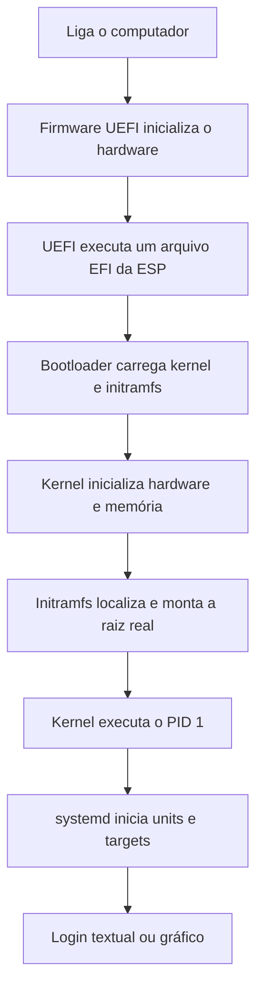

# Como o Linux faz boot

> [!abstract] Resumo
> O vídeo usa a instalação de uma distribuição Linux como ponto de partida para explicar como o computador passa de uma máquina recém-ligada para um desktop utilizável. O fio condutor é: **firmware UEFI → programa de boot → kernel → initramfs → sistema de arquivos raiz → PID 1 → serviços → interface gráfica**. No caminho, são apresentados pontos de montagem, sistemas de arquivos virtuais, dispositivos de bloco, imagens de disco, `dd`, `/proc`, `/dev`, runlevels, SysV init e `systemd`.

> [!note] Critério desta nota
> A transcrição foi tratada como a fonte principal do conteúdo do vídeo. Quando a fala está desatualizada, simplificada demais ou factualmente incorreta, há uma caixa **Correção/atualização** logo abaixo do assunto correspondente.

## Objetivos de estudo

Ao terminar esta nota, deve ser possível explicar:

- por que um Linux pode iniciar diretamente de um pendrive;
- a diferença entre dispositivo, partição, sistema de arquivos e ponto de montagem;
- por que `/proc`, `/dev` e `/sys` parecem diretórios normais, embora exponham informações do kernel;
- o que é uma imagem de disco e por que um arquivo pode ser montado como se fosse um dispositivo;
- as funções de UEFI, GPT, partição EFI, GRUB, kernel e initramfs;
- por que o primeiro processo do espaço de usuário possui PID 1;
- como SysV init organizava serviços e como `systemd` usa units e targets;
- quais comandos ajudam a investigar boot, kernel e serviços.

## Visão geral do boot



### Modelo mental em uma frase

O firmware encontra um executável de boot; esse executável carrega o kernel e um ambiente inicial; o ambiente inicial disponibiliza o sistema real; então o PID 1 organiza os serviços necessários para tornar a máquina utilizável.

---

## 1. Instalação e ambiente live (`01:15`)

O processo mostrado no vídeo é o fluxo típico de uma instalação desktop:

1. baixar uma imagem ISO;
2. gravá-la em um pendrive com uma ferramenta como Rufus;
3. configurar o computador para iniciar pelo USB;
4. entrar em um ambiente **live**, executado sem uma instalação prévia no disco principal;
5. testar se vídeo, som, teclado, mouse, rede e outros dispositivos funcionam;
6. abrir o instalador e escolher idioma, teclado, pacotes, disco, particionamento, usuário e senha;
7. copiar o sistema para o disco e configurar o boot;
8. reiniciar sem o pendrive.

O ambiente live é importante porque já contém um sistema inicializável dentro da imagem gravada no USB. Ele permite testar compatibilidade e também pode servir como ambiente de manutenção ou recuperação.

### Escolhas durante a instalação

O vídeo destaca estas decisões:

- instalação completa ou mínima;
- baixar atualizações durante a instalação;
- instalar codecs e drivers de terceiros;
- particionamento automático ou manual;
- escolha do sistema de arquivos, como ext4 ou ZFS;
- criação do usuário e configuração de login.

Drivers e codecs proprietários podem ser necessários para que determinado hardware ou formato multimídia funcione. A decisão envolve uma diferença entre conveniência prática e preferência por software cujo código e licença sejam livres.

> [!warning] Correção/atualização — instalador do Ubuntu
> O vídeo generaliza o Calamares e o atribui ao Ubuntu. O **Ubuntu 22.04 Desktop usava Ubiquity**, e o **Ubuntu 24.04 Desktop usa o Ubuntu Desktop Installer, com Subiquity como backend**. Calamares é usado por diversas distribuições e por alguns sabores do Ubuntu, mas não por “quase toda distro” e não pelo Ubuntu Desktop principal. Consulte a [documentação de instalação do Ubuntu 24.04](https://documentation.ubuntu.com/desktop/en/24.04/tutorial/install-ubuntu-desktop/) e a [discussão oficial sobre os instaladores dos sabores 24.04](https://discourse.ubuntu.com/t/installers-in-24-04-lts/41498).

> [!warning] Correção — conta `root` no Ubuntu
> A instalação padrão do Ubuntu normalmente **não solicita uma senha separada para `root`**. A conta possui a senha bloqueada e o primeiro usuário administrativo eleva privilégios com `sudo`. A senha pedida por `sudo` é a do próprio usuário. Veja [RootSudo — Ubuntu Community Help Wiki](https://help.ubuntu.com/community/RootSudo).

> [!warning] Segurança — senha e login automático
> Reutilizar a mesma senha, habilitar login automático ou justificar isso apenas com “só eu uso o computador” ignora acesso físico, furto e uso remoto. Para uma máquina de estudo sem dados relevantes, o risco pode ser aceito conscientemente; para um notebook ou servidor, prefira uma senha longa e exclusiva, criptografia de disco e login autenticado.

> [!info] Atualização — NVIDIA
> A afirmação de que somente uma parte irrelevante do driver foi aberta ficou desatualizada. Desde a série R560, a NVIDIA recomenda os **módulos de kernel abertos**, sob licenças GPL/MIT, para GPUs Turing e mais novas; GPUs Maxwell, Pascal e Volta ainda dependem dos módulos proprietários. Isso não significa que toda a pilha de usuário e firmware se tornou software livre. Veja o [anúncio técnico da NVIDIA](https://developer.nvidia.com/blog/nvidia-transitions-fully-towards-open-source-gpu-kernel-modules/).

> [!note] ZFS não é uma escolha universal
> O vídeo recomenda testar ZFS no Ubuntu. ZFS oferece recursos avançados, mas aumenta a complexidade operacional e não é automaticamente melhor para todo iniciante. ext4 continua sendo uma escolha simples e sólida. No Ubuntu 24.04, a instalação guiada com ZFS foi reintroduzida, mas algumas combinações de criptografia e hardware têm limitações; consulte as [notas do Ubuntu 24.04](https://documentation.ubuntu.com/release-notes/24.04/).

---

## 2. “Tudo é arquivo”, `/proc`, `/dev` e mount points (`06:11`)

Uma ideia herdada do Unix é expor muitos recursos por meio de uma interface parecida com arquivos. Isso não significa literalmente que todo recurso seja um arquivo persistente em disco; significa que vários recursos podem ser acessados com operações e ferramentas familiares, como abrir, ler, escrever e listar.

### Processos e `/proc`

Cada processo possui um **PID** (Process ID). Comandos citados:

```bash
ps
ps aux
cat /proc/<PID>/status
```

- `ps` sem opções normalmente mostra uma seleção pequena de processos relacionada ao terminal atual;
- `ps aux` mostra uma visão ampla dos processos do sistema;
- `/proc/<PID>/status` expõe estado, memória, identificadores e outras informações do processo.

`/proc` é um pseudo-sistema de arquivos fornecido pelo kernel. Os itens vistos ali não são arquivos comuns gravados no disco. Ferramentas de monitoramento como `ps`, `top` e `htop` obtêm muitas informações por meio de `/proc`.

> [!warning] Correção — sinais de processo
> `kill -9 <PID>` envia **SIGKILL**, não SIGTERM. SIGKILL encerra o processo sem permitir tratamento ou limpeza. O caminho normal é começar com `kill <PID>` ou `kill -TERM <PID>` e usar `kill -KILL <PID>` apenas se o processo não responder. A página de manual recomenda TERM antes de KILL: [`kill(1)`](https://man7.org/linux/man-pages/man1/kill.1.html).

> [!note] Precisão sobre `/proc`
> `/proc` não “desaparece quando dá boot”. Ele é montado durante a execução e representa o estado atual do kernel e dos processos. Se o disco for conectado a outra máquina, o diretório que serve de ponto de montagem pode existir, mas os dados virtuais da execução anterior não estarão armazenados nele.

### Dispositivos e `/dev`

`/dev` contém **device nodes**, interfaces que permitem ao espaço de usuário interagir com dispositivos administrados pelo kernel. Exemplos:

- `/dev/sda` — um disco no esquema de nomes SCSI/SATA/USB;
- `/dev/sda1` — a primeira partição desse disco;
- `/dev/nvme0n1` — um NVMe;
- `/dev/nvme0n1p1` — a primeira partição do NVMe;
- `/dev/null`, `/dev/zero` e `/dev/urandom` — dispositivos especiais virtuais.

Para listar dispositivos de bloco:

```bash
lsblk
lsblk -f
```

`lsblk -f` também ajuda a visualizar sistema de arquivos, UUID e ponto de montagem.

> [!warning] Correção — nomes dos discos
> Nem todo disco aparece como `sda`, `sdb` e `sdc`. NVMe costuma usar `nvme0n1`, cartões MMC podem usar `mmcblk0`, e máquinas virtuais podem apresentar `vda`. Confirme o alvo com `lsblk`, tamanho, modelo e UUID antes de executar comandos destrutivos.

### O que é um ponto de montagem

Um **ponto de montagem** é um diretório da árvore de arquivos no qual o conteúdo de um sistema de arquivos passa a ser visível.

No Windows, o caso mais comum é associar volumes a letras como `C:` e `D:`. No Linux, todos os sistemas de arquivos podem ser integrados a uma única árvore iniciada em `/`.

Exemplo conceitual:

```text
dispositivo/partição: /dev/sda2
sistema de arquivos:  ext4
ponto de montagem:    /
```

Ao montar um pendrive, o sistema associa o sistema de arquivos da partição a um diretório, por exemplo:

```bash
sudo mount -t vfat /dev/sdc1 /mnt/pendrive
sudo umount /mnt/pendrive
```

O comando correto para desmontar é `umount` — sem “n” depois do “u”. É necessário desmontar antes de remover um dispositivo para que escritas pendentes sejam concluídas.

### `/etc/fstab`

`/etc/fstab` descreve sistemas de arquivos que devem ser montados, seus pontos de montagem, tipos e opções. Uma linha costuma possuir:

```text
<origem>  <ponto>  <tipo>  <opções>  <dump>  <pass>
```

É comum usar UUIDs em vez de nomes como `/dev/sda2`, porque a ordem dos nomes dos dispositivos pode mudar.

Comandos úteis:

```bash
findmnt
mount
cat /etc/fstab
blkid
```

---

## 3. Firmware, UEFI, GPT e início do boot (`11:49`)

Quando o computador é ligado, o sistema operacional ainda não está em execução. O primeiro software relevante é o **firmware**, armazenado na placa-mãe.

### BIOS legado

O BIOS tradicional inicializa componentes básicos e procura código inicial de boot no disco. No esquema clássico BIOS + MBR:

- o primeiro setor contém o Master Boot Record;
- o MBR guarda código inicial de boot e uma tabela de partições pequena;
- a tabela MBR oferece quatro entradas de partição primária, podendo contornar o limite com uma partição estendida.

### UEFI e GPT

Em computadores modernos, UEFI substitui o fluxo legado de BIOS. GPT é o esquema de particionamento moderno normalmente usado junto com UEFI.

Uma instalação UEFI típica possui uma **EFI System Partition (ESP)**, geralmente formatada em FAT. O firmware entende esse formato e consegue executar arquivos `.efi` armazenados nela, como GRUB, `systemd-boot`, `shim` ou um carregador do Windows.

> [!warning] Correções — siglas e limites
> UEFI significa **Unified Extensible Firmware Interface**, não “Universal”. O limite de quatro partições primárias vem da estrutura da tabela MBR, não de “identificadores de 16 bits”. GUIDs são valores de **128 bits**, não 32 bits. GPT também não significa partições literalmente ilimitadas: o cabeçalho informa quantas entradas existem; 128 é um padrão comum. Veja a [especificação UEFI/GPT](https://uefi.org/specs/UEFI/2.10/05_GUID_Partition_Table_Format.html) e o [glossário UEFI](https://uefi.org/specs/UEFI/2.11/Apx_R_Glossary.html).

### ESP, `/boot/efi` e `/boot`

Em muitas distribuições:

- a ESP é montada em `/boot/efi`;
- kernels, initramfs e arquivos do GRUB ficam em `/boot`;
- `/boot` pode estar dentro da partição raiz ou em uma partição separada;
- a ESP e `/boot` não são necessariamente a mesma partição.

> [!warning] Correção — partição de boot
> O vídeo mistura `/boot` com a ESP. O que o firmware UEFI precisa ler é a **EFI System Partition**, frequentemente montada em `/boot/efi`. `/boot` não precisa ser FAT32; pode estar em ext4, Btrfs ou outro sistema compatível com o carregador. Também não é correto dizer que sempre existirá uma partição `/boot` pequena de pouco mais de 100 MB. A organização e o tamanho variam conforme a distribuição, criptografia, bootloader e quantidade de kernels mantidos.

### O papel do bootloader

O firmware UEFI escolhe e executa um arquivo EFI. Esse arquivo pode ser um gerenciador/carregador como GRUB. O GRUB lê sua configuração, apresenta opções e carrega na memória:

- o kernel, normalmente um arquivo como `/boot/vmlinuz-<versão>`;
- uma imagem initramfs, normalmente `/boot/initrd.img-<versão>` no Ubuntu;
- parâmetros da linha de comando do kernel.

> [!warning] Correção — UEFI não torna bootloaders desnecessários em geral
> UEFI sabe executar aplicações EFI, mas isso não elimina automaticamente a função do carregador. GRUB continua útil para selecionar sistemas, versões de kernel, modos de recuperação e parâmetros. Em alguns cenários, o firmware pode iniciar diretamente um kernel preparado como EFI stub ou uma Unified Kernel Image, mas isso é uma arquitetura alternativa, não a regra universal.

---

## 4. Imagens de disco, `dd`, loop devices e Live USB (`15:49`)

### Cópia em nível de blocos com `dd`

`dd` copia bytes entre uma entrada e uma saída. Um exemplo simplificado para gravar uma ISO em um pendrive seria:

```bash
sudo dd if=ubuntu.iso of=/dev/sdX bs=4M status=progress conv=fsync
```

Nesse comando:

- `if` é o arquivo de entrada (*input file*);
- `of` é o arquivo ou dispositivo de saída (*output file*);
- `bs` define o tamanho dos blocos usados na cópia;
- `status=progress` mostra o andamento;
- `conv=fsync` solicita a sincronização dos dados antes de concluir.

> [!danger] Risco de perda total
> `dd` não pergunta se o destino está correto. Se `/dev/sdX` for o disco do sistema em vez do pendrive, os dados serão sobrescritos. Confirme o dispositivo com `lsblk -o NAME,SIZE,MODEL,TRAN,MOUNTPOINTS` e desmonte suas partições antes de gravar.

> [!warning] Correção — origem do nome `dd`
> A explicação “copy and convert deveria ser `cc`, mas `cc` já era o compilador” é uma história popular, não uma etimologia confiável. O nome é geralmente associado à sintaxe `DD` (*Data Definition*) do IBM Job Control Language. `if=` e `of=` realmente significam *input file* e *output file*.

### Dispositivos virtuais especiais

#### `/dev/null`

Descarta tudo que é escrito nele e retorna fim de arquivo quando lido:

```bash
comando > /dev/null
comando > /dev/null 2>&1
```

#### `/dev/zero`

Fornece bytes zero continuamente quando lido. Pode ser usado para criar um arquivo preenchido com zeros:

```bash
dd if=/dev/zero of=hello.img bs=1M count=10
```

Hoje, para simplesmente alocar um arquivo, `truncate` ou `fallocate` também podem ser mais rápidos, embora criem arquivos com propriedades diferentes de uma escrita completa de zeros:

```bash
truncate -s 10M hello.img
fallocate -l 10M hello.img
```

#### `/dev/urandom`

Fornece bytes gerados pelo gerador criptográfico do kernel, depois de inicializado com entropia coletada pelo sistema.

> [!warning] Correção — aleatoriedade
> Dizer que “computadores não possuem aleatoriedade verdadeira” é uma simplificação excessiva. Sistemas reais coletam entropia de eventos físicos e dispositivos de hardware e usam esse estado para alimentar um gerador criptograficamente seguro. O ponto prático é: para criptografia, use APIs seguras do sistema ou da linguagem, não implemente seu próprio gerador.

### Criando um sistema de arquivos dentro de um arquivo

O vídeo demonstra que um arquivo comum pode conter a mesma organização de bytes usada em uma partição:

```bash
dd if=/dev/zero of=hello.img bs=1M count=10
mkfs.vfat -F 32 hello.img
mkdir hello
sudo mount -o loop hello.img hello
```

Depois da montagem, criar `hello/blabla.txt` escreve dados dentro do sistema de arquivos contido em `hello.img`. Após `umount hello`, o diretório `hello` volta a mostrar apenas seu conteúdo original; o arquivo criado permanece dentro da imagem.

O kernel normalmente associa a imagem a um **loop device**, como `/dev/loop0`, para apresentá-la às camadas de bloco e sistema de arquivos.

### Montando uma ISO

Uma imagem ISO pode ser montada somente para leitura:

```bash
sudo mount -o loop,ro ubuntu.iso /mnt/iso
```

O conteúdo inclui os arquivos necessários para inicializar o ambiente live e executar o instalador. Imagens modernas de distribuição costumam ser **híbridas**, preparadas para funcionar tanto como imagem óptica quanto quando gravadas em USB.

### Abstração importante

O aprendizado central não é que “qualquer sequência de bits é automaticamente um dispositivo de bloco”, mas que o sistema operacional usa camadas de abstração:

```text
hardware ou arquivo
        ↓
interface de bloco/loop
        ↓
sistema de arquivos
        ↓
VFS do kernel
        ↓
diretórios e arquivos vistos pelos programas
```

> [!warning] Correção — armazenamento remoto
> Google Drive, Dropbox e outros serviços montados não são necessariamente dispositivos de bloco. NFS, SMB e implementações FUSE podem expor operações de arquivos diretamente ao VFS, traduzindo-as para protocolos de rede ou APIs HTTP. A experiência para o programa é parecida com a de um sistema de arquivos local, mas a camada inferior não precisa oferecer leitura e escrita de blocos.

---

## 5. Kernel, initramfs e montagem da raiz real (`25:32`)

### O que é o kernel

O kernel Linux é a parte central do sistema que executa em modo privilegiado e administra:

- CPU e escalonamento de processos;
- memória virtual;
- drivers e dispositivos;
- sistemas de arquivos;
- rede;
- comunicação entre processos;
- chamadas de sistema usadas pelos programas.

Distribuições chamadas informalmente de “Linux” combinam o kernel Linux com bibliotecas, ferramentas, gerenciador de pacotes, serviços e aplicações. Muitas ferramentas tradicionais vêm do projeto GNU, daí o termo **GNU/Linux**, embora nem todo sistema baseado no kernel Linux use predominantemente componentes GNU.

### Por que existe um ambiente inicial

O kernel precisa montar o sistema de arquivos raiz real, mas pode depender de recursos que ainda não estão disponíveis, por exemplo:

- módulos do driver de armazenamento;
- LUKS para descriptografar o disco;
- LVM para ativar volumes lógicos;
- RAID por software;
- drivers ou ferramentas para obter a raiz pela rede;
- regras para localizar o volume raiz correto.

A solução é carregar um ambiente pequeno em memória: o **initramfs**.

### Sequência do initramfs

1. o bootloader coloca o kernel e a imagem initramfs na memória;
2. o kernel inicia e descompacta o arquivo CPIO do initramfs em seu `rootfs` inicial;
3. o programa `/init` desse ambiente é executado;
4. scripts e ferramentas carregam módulos, desbloqueiam criptografia e ativam volumes;
5. a raiz real é montada;
6. ocorre a troca para a raiz real, normalmente com `switch_root`;
7. o `init` real do sistema é executado como PID 1, frequentemente `systemd`.

Em sistemas baseados em Debian/Ubuntu, ferramentas úteis incluem:

```bash
lsinitramfs /boot/initrd.img-$(uname -r)
unmkinitramfs /boot/initrd.img-$(uname -r) ./initramfs-extraido
```

> [!warning] Correção — `initrd` e `initramfs`
> O vídeo trata os termos quase como equivalentes. Historicamente, **initrd** era uma imagem de sistema de arquivos em bloco carregada em RAM. **initramfs** é um arquivo CPIO compactado que o kernel extrai no `rootfs` inicial. Distribuições ainda podem chamar o arquivo de `initrd.img`, mesmo quando seu conteúdo é um initramfs. A documentação do kernel explica a distinção em [Ramfs, rootfs and initramfs](https://docs.kernel.org/filesystems/ramfs-rootfs-initramfs.html).

> [!warning] Correção — kernel e initramfs são arquivos separados
> Na instalação comum descrita no vídeo, o initramfs externo não está “comprimido junto com o kernel”. O bootloader carrega dois arquivos separados: `vmlinuz` e `initrd.img-*`. O kernel também pode conter um initramfs embutido na compilação, mas isso é outro caso.

> [!note] Formato de compressão varia
> A imagem é tipicamente um arquivo CPIO compactado, mas gzip, LZ4, XZ e Zstandard são possibilidades. Não se deve assumir LZ4 apenas porque o exemplo do vídeo usava uma determinada versão do Ubuntu.

---

## 6. PID 1, daemons e serviços (`31:29`)

Depois que a raiz real está disponível, o kernel inicia o primeiro processo do espaço de usuário. Esse processo recebe **PID 1** e possui responsabilidades especiais durante toda a execução do sistema.

Em grande parte das distribuições atuais, `/sbin/init` aponta para `systemd`. Outras possibilidades incluem OpenRC com um init compatível, runit, s6 e sistemas próprios.

O PID 1 inicia e supervisiona o restante do sistema:

- montagem de sistemas de arquivos;
- configuração de dispositivos;
- rede e DHCP;
- Bluetooth;
- logging;
- servidores como SSH, banco de dados e Docker;
- consoles de login;
- display manager e sessão gráfica.

Um **daemon** é um processo de longa duração que presta algum serviço em segundo plano. O arquivo de unidade ou script de inicialização descreve como iniciar, parar, reiniciar e, em alguns sistemas, supervisionar esse processo.

### Diagnóstico do boot

```bash
dmesg
journalctl -b
systemctl --failed
systemctl status <serviço>
journalctl -u <serviço> -b
```

- `dmesg` mostra o **buffer de mensagens do kernel**;
- `journalctl -b` mostra o journal do boot atual, incluindo kernel e serviços;
- `systemctl --failed` lista units que falharam;
- `systemctl status` resume o estado de uma unit;
- `journalctl -u` filtra logs de uma unit.

> [!warning] Correção — `dmesg`
> O vídeo sugere `dmesg` para rever todas as linhas de serviços do boot. `dmesg` examina o ring buffer do **kernel**, não é o registro completo dos serviços do `systemd`. Para o boot completo, use `journalctl -b`. Veja [`dmesg(1)`](https://man7.org/linux/man-pages/man1/dmesg.1.html) e [`journalctl(1)`](https://man7.org/linux/man-pages/man1/journalctl.1.html).

> [!warning] Correção — alternativas ao systemd
> Slackware usa tradicionalmente scripts de inicialização no estilo BSD combinados com conceitos de SysV, não OpenRC por padrão. Gentoo usa OpenRC por padrão, mas suporta systemd. runit surgiu nos anos 2000 e não vem da época dos Unix originais. Os BSDs normalmente possuem seu próprio sistema `rc`, não runit como padrão. Consulte [SlackDocs](https://docs.slackware.com/howtos%3Aslackware_admin%3Arunit), [runit](https://smarden.org/runit/) e a [documentação do FreeBSD sobre `rc.d`](https://docs.freebsd.org/en/articles/rc-scripting/).

---

## 7. SysV init e runlevels (`33:31`)

Antes da adoção ampla do `systemd`, muitas distribuições Linux utilizavam o modelo SysV init.

### Funcionamento conceitual

- o kernel iniciava `/sbin/init` como PID 1;
- `/etc/inittab` ajudava a definir o estado padrão;
- scripts de serviços ficavam em `/etc/init.d/`;
- diretórios como `/etc/rc3.d/` e `/etc/rc5.d/` continham links para esses scripts;
- nomes e ordem dos links determinavam quais scripts eram iniciados ou encerrados.

### Runlevels tradicionais

| Runlevel | Uso comum |
|---:|---|
| `0` | desligamento |
| `1` | modo de usuário único/manutenção |
| `2` | varia conforme a distribuição |
| `3` | multiusuário em modo texto, normalmente com rede |
| `4` | varia ou fica disponível para configuração local |
| `5` | multiusuário com interface gráfica |
| `6` | reinicialização |

Essas associações não são universais. Debian e derivados, por exemplo, historicamente tratavam os runlevels 2 a 5 de modo semelhante por padrão.

### Desligamento gracioso

Comandos como `shutdown`, `reboot` e `poweroff` avisam o sistema de init, encerram serviços e dão ao kernel a oportunidade de sincronizar dados e desmontar sistemas de arquivos.

```bash
sudo shutdown -h now
sudo reboot
sudo poweroff
```

Um reset forçado deve ser o último recurso, porque processos podem estar escrevendo dados e o kernel pode manter páginas modificadas em cache.

### Consoles virtuais não são runlevels

Atalhos como `Ctrl+Alt+F3` trocam para outro **TTY virtual**, no qual é possível fazer login em modo texto e diagnosticar um desktop travado:

```bash
ps aux | grep '[f]irefox'
kill <PID>
# somente se não encerrar:
kill -9 <PID>
```

> [!warning] Correção — `Ctrl+Alt+F3`
> Trocar para TTY3 **não muda o sistema para runlevel 3**. A sessão gráfica e seus serviços continuam ativos; apenas o console exibido na tela mudou. Os números das teclas de função e dos TTYs não têm relação direta com os números dos runlevels.

> [!warning] Correção — boot de manutenção
> Acrescentar apenas `3` à linha do kernel pode funcionar por compatibilidade em alguns sistemas com `systemd`, mas não é a forma mais explícita e portátil. Parâmetros como `systemd.unit=multi-user.target`, `systemd.unit=rescue.target` ou `systemd.unit=emergency.target` expressam melhor o objetivo em uma distribuição com systemd. A forma de abrir o GRUB também varia: `Shift` é comum em boot legado e `Esc` pode ser necessário em UEFI.

---

## 8. `systemd`, units e targets (`40:46`)

`systemd` substitui o fluxo estritamente sequencial de scripts SysV por um grafo de **units**, dependências e ativações. Ele não é apenas um iniciador de serviços: a suíte também inclui logging, gerenciamento de sessões, timers, sockets, mounts, resolução de nomes e outros componentes.

### Tipos de unit

| Tipo | Função |
|---|---|
| `.service` | processo ou daemon |
| `.target` | agrupamento/sincronização de units |
| `.socket` | socket que pode ativar um serviço sob demanda |
| `.timer` | agendamento semelhante ao cron |
| `.mount` | ponto de montagem |
| `.automount` | montagem sob demanda |
| `.path` | ativação ao observar um caminho |
| `.device` | dispositivo conhecido pelo systemd |

Arquivos de unit podem existir, entre outros locais, em:

```text
/usr/lib/systemd/system/  # units fornecidas por pacotes na maioria das distros
/lib/systemd/system/      # caminho usado em algumas distribuições
/etc/systemd/system/      # configuração e overrides do administrador
/run/systemd/system/      # units geradas em tempo de execução
```

### Targets e equivalência aproximada

| SysV | systemd |
|---|---|
| runlevel 0 | `poweroff.target` |
| runlevel 1 | `rescue.target` |
| runlevels 2–4 | `multi-user.target` |
| runlevel 5 | `graphical.target` |
| runlevel 6 | `reboot.target` |

Essa equivalência existe para compatibilidade e compreensão, mas targets são mais flexíveis que um único número de estado.

`graphical.target` normalmente puxa `multi-user.target` e adiciona a infraestrutura de login gráfico, como um display manager.

### Comandos essenciais

```bash
# target padrão usado nos próximos boots
systemctl get-default

# muda imediatamente para um target sem alterar o padrão persistente
sudo systemctl isolate multi-user.target

# muda o padrão dos próximos boots
sudo systemctl set-default multi-user.target

# volta à interface gráfica na sessão atual
sudo systemctl isolate graphical.target

# inicia, encerra e reinicia um serviço agora
sudo systemctl start docker.service
sudo systemctl stop docker.service
sudo systemctl restart docker.service

# configura o serviço para ser puxado no boot conforme [Install]
sudo systemctl enable docker.service

# habilita e inicia imediatamente
sudo systemctl enable --now docker.service

# consulta estado e units
systemctl status docker.service
systemctl list-units --type=service
systemctl list-unit-files --type=service
systemctl --failed
```

### `start` não é `enable`

- `start`: ativa agora, sem necessariamente persistir para o próximo boot;
- `enable`: cria as relações/symlinks descritos na seção `[Install]`, mas não necessariamente inicia agora;
- `enable --now`: habilita para o boot e inicia imediatamente;
- `disable`: remove a habilitação, sem necessariamente parar agora;
- `mask`: impede ativações manuais e por dependência, até que a unit seja desmascarada.

> [!warning] Correção — `isolate` não reinicia por definição
> `systemctl isolate multi-user.target` não deveria ser descrito como um reboot. Ele inicia o target e interrompe units que não são necessárias ao novo target, podendo encerrar a interface gráfica e sessões. É uma operação disruptiva, mas ocorre no sistema em execução. `set-default` é que altera o target persistente dos próximos boots. Consulte [`systemctl(1)`](https://man7.org/linux/man-pages/man1/systemctl.1.html).

> [!warning] Correção — o destino de `enable`
> `systemctl enable docker` não “adiciona ao `graphical.target`” necessariamente. O comando segue a seção `[Install]` da unit; serviços de sistema como Docker costumam declarar `WantedBy=multi-user.target`. Como `graphical.target` puxa `multi-user.target`, o serviço também aparece em um boot gráfico. Veja [`systemd.special(7)`](https://man7.org/linux/man-pages/man7/systemd.special.7.html) e [`systemd.unit(5)`](https://man.archlinux.org/man/systemd.unit.5.en).

---

## 9. Sequência completa consolidada

1. **Energia e firmware** — UEFI executa sua inicialização de plataforma e enumera hardware básico.
2. **Seleção de boot** — variáveis de boot do firmware apontam para um executável na EFI System Partition.
3. **Carregador** — GRUB, `systemd-boot`, shim ou outro componente é executado.
4. **Kernel e parâmetros** — o carregador coloca o kernel, o initramfs e a linha de comando na memória.
5. **Kernel** — configura memória, escalonador, subsistemas e drivers embutidos; começa a detectar dispositivos.
6. **Rootfs inicial** — o initramfs é extraído e seu `/init` é executado.
7. **Preparação do armazenamento** — módulos são carregados; LUKS, LVM ou RAID são ativados; a raiz real é localizada.
8. **Troca de raiz** — `switch_root` transfere o ambiente para o sistema de arquivos raiz real.
9. **PID 1 real** — normalmente `systemd` passa a administrar o espaço de usuário.
10. **Units e mounts** — sistemas de arquivos, udev, rede, logs e demais serviços são iniciados conforme dependências.
11. **Login** — `getty` oferece login textual ou um display manager oferece login gráfico.
12. **Sessão do usuário** — shell ou ambiente gráfico inicia os processos do usuário.

---

## 10. Tabela de conceitos

| Conceito | Definição curta | Exemplo |
|---|---|---|
| firmware | software de baixo nível que inicia a plataforma | UEFI |
| ESP | partição que guarda executáveis EFI | FAT montada em `/boot/efi` |
| bootloader | carrega/seleciona kernel e opções de boot | GRUB |
| kernel | núcleo privilegiado do sistema operacional | `vmlinuz-*` |
| initramfs | ambiente inicial em memória para alcançar a raiz real | `initrd.img-*` contendo CPIO |
| PID | identificador numérico de um processo | PID 1 para o init do sistema |
| daemon | processo de longa duração que fornece um serviço | `sshd`, `dockerd` |
| unit | objeto administrado pelo systemd | `docker.service` |
| target | agrupamento e ponto de sincronização de units | `graphical.target` |
| dispositivo de bloco | interface de acesso a dados em blocos | `/dev/sda`, `/dev/nvme0n1` |
| partição | região lógica de um dispositivo | `/dev/nvme0n1p2` |
| sistema de arquivos | estrutura que organiza arquivos e metadados | ext4, FAT32, ZFS |
| ponto de montagem | diretório no qual um sistema de arquivos aparece | `/`, `/boot/efi`, `/mnt/usb` |
| pseudo-filesystem | visão gerada pelo kernel, não persistida como arquivos comuns | `/proc`, `/sys` |
| imagem de disco | arquivo que contém uma organização de bytes montável ou gravável | `.iso`, `.img`, `.vhd` |
| loop device | apresenta um arquivo como dispositivo de bloco | `/dev/loop0` |

---

## 11. Comandos para praticar com segurança

### Inspecionar sem alterar

```bash
uname -r
lsblk -f
findmnt
findmnt /
findmnt /boot/efi
cat /etc/fstab
cat /proc/cmdline
cat /proc/1/status
readlink -f /sbin/init
systemctl get-default
systemctl --failed
systemd-analyze
systemd-analyze blame
journalctl -b -p warning
dmesg --level=err,warn
```

### Explorar processos

```bash
ps aux
ps -p 1 -o pid,ppid,user,comm,args
cat /proc/1/status
ls -l /proc/1/exe
```

### Explorar units e dependências

```bash
systemctl status sshd.service
systemctl cat sshd.service
systemctl show sshd.service
systemctl list-dependencies graphical.target
systemctl list-dependencies multi-user.target
```

> [!tip] No Fedora
> O serviço SSH costuma se chamar `sshd.service`. Em Ubuntu/Debian, muitos exemplos usam `ssh.service`. Use `systemctl list-unit-files | grep -i ssh` para confirmar o nome existente na distribuição.

### Laboratório seguro com uma imagem

Execute em uma pasta de testes e não use caminhos de discos reais:

```bash
truncate -s 64M laboratorio.img
mkfs.ext4 -F laboratorio.img
mkdir -p mnt-laboratorio
sudo mount -o loop laboratorio.img mnt-laboratorio
findmnt mnt-laboratorio
sudo touch mnt-laboratorio/exemplo.txt
sudo umount mnt-laboratorio
```

O exercício demonstra que:

- um arquivo pode conter um sistema de arquivos;
- um loop device conecta o arquivo à camada de bloco;
- o ponto de montagem apenas revela aquele conteúdo dentro da árvore;
- ao desmontar, o conteúdo continua na imagem, não no diretório usado como mount point.

---

## 12. Perguntas de revisão

1. Qual é a diferença entre `/dev/nvme0n1`, `/dev/nvme0n1p1`, FAT32 e `/boot/efi`?
2. Por que um pendrive live consegue iniciar sem que o Linux esteja instalado no SSD?
3. Por que `/proc/<PID>/status` não é um arquivo comum persistente?
4. O que o VFS permite abstrair?
5. Por que o firmware consegue acessar a ESP antes de o kernel iniciar?
6. Qual é a diferença entre ESP, `/boot` e `/boot/efi`?
7. Por que GRUB carrega tanto o kernel quanto o initramfs?
8. Em que situação o initramfs precisa lidar com LUKS, LVM ou RAID?
9. Qual é a diferença histórica entre initrd e initramfs?
10. Por que o PID 1 é especial?
11. Qual é a diferença entre um daemon e uma unit `.service`?
12. Qual é a diferença entre `systemctl start`, `enable` e `enable --now`?
13. Por que `Ctrl+Alt+F3` não equivale ao runlevel 3?
14. Quando usar `dmesg` e quando usar `journalctl -b`?
15. Por que `kill -9` deve ser a última tentativa?

---

## 13. Pontos essenciais para memorizar

- Linux integra sistemas de arquivos diferentes em uma única árvore iniciada em `/`.
- Um mount point é um local de encaixe; ele não copia os arquivos para o diretório.
- `/proc`, `/sys` e boa parte de `/dev` expõem estado e interfaces do kernel em tempo de execução.
- Uma imagem de disco é um arquivo com bytes organizados como mídia ou sistema de arquivos; loop devices permitem tratá-la como bloco.
- UEFI executa arquivos EFI da ESP; GRUB é uma possível etapa posterior, não sinônimo de UEFI.
- GPT usa GUIDs de 128 bits e supera as limitações estruturais do MBR.
- O kernel não é a distribuição inteira; ele é o núcleo que gerencia recursos e oferece chamadas de sistema.
- O initramfs existe para preparar o caminho até o sistema de arquivos raiz real.
- O PID 1 inicia e administra o espaço de usuário; em muitas distribuições ele é o `systemd`.
- SysV usa runlevels e scripts; systemd usa units, dependências e targets.
- TTY virtual, runlevel e target são conceitos diferentes.
- Para serviços: `start` age agora; `enable` configura ativação futura; `enable --now` faz ambos.
- Para diagnóstico: `dmesg` é focado no kernel; `journalctl -b` cobre o journal do boot; `systemctl --failed` destaca falhas de units.
- Comandos de baixo nível como `dd` e `mkfs` exigem confirmar o destino mais de uma vez.

## Referências usadas nas correções

- [Ubuntu Desktop 24.04 — instalação](https://documentation.ubuntu.com/desktop/en/24.04/tutorial/install-ubuntu-desktop/)
- [Ubuntu 24.04 LTS — release notes](https://documentation.ubuntu.com/release-notes/24.04/)
- [Ubuntu Community Help — RootSudo](https://help.ubuntu.com/community/RootSudo)
- [NVIDIA — Open GPU Kernel Modules](https://developer.nvidia.com/blog/nvidia-transitions-fully-towards-open-source-gpu-kernel-modules/)
- [UEFI Specification — GPT Disk Layout](https://uefi.org/specs/UEFI/2.10/05_GUID_Partition_Table_Format.html)
- [Linux kernel — Ramfs, rootfs and initramfs](https://docs.kernel.org/filesystems/ramfs-rootfs-initramfs.html)
- [Linux man-pages — `kill(1)`](https://man7.org/linux/man-pages/man1/kill.1.html)
- [Linux man-pages — `dmesg(1)`](https://man7.org/linux/man-pages/man1/dmesg.1.html)
- [Linux man-pages — `journalctl(1)`](https://man7.org/linux/man-pages/man1/journalctl.1.html)
- [Linux man-pages — `systemctl(1)`](https://man7.org/linux/man-pages/man1/systemctl.1.html)
- [Linux man-pages — `systemd.special(7)`](https://man7.org/linux/man-pages/man7/systemd.special.7.html)
- [FreeBSD — Practical rc.d scripting](https://docs.freebsd.org/en/articles/rc-scripting/)
