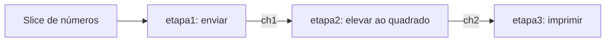

Um **pipeline** organiza o processamento em etapas conectadas por canais. Cada etapa faz uma parte do trabalho e passa o resultado para a próxima, como uma linha de produção. É um padrão que construímos com funções, goroutines e channels, sem uma palavra-chave especial da linguagem. Veja a definição no [guia oficial de pipelines em Go](https://go.dev/blog/pipelines).

Antes de começar, revise [[03-goroutines|goroutines]] e [[04-channels|channels]]. O exemplo abaixo segue a ideia da aula: enviar números, calcular seus quadrados e imprimir os resultados.

## 1. As três etapas da linha de produção



| Etapa | Responsabilidade | Onde executa |
| --- | --- | --- |
| `etapa1` | Percorrer o slice e enviar os números para `ch1` | Uma nova goroutine |
| `etapa2` | Receber de `ch1`, calcular `n * n` e enviar para `ch2` | Uma nova goroutine |
| `etapa3` | Receber de `ch2` e imprimir | A própria goroutine de `main` |

Salve como `main.go` e execute com `go run main.go`:

```go
package main

import "fmt"

func etapa1(ch1 chan<- int, numbers []int) {
    for _, n := range numbers {
        ch1 <- n // Envia cada número para a próxima etapa.
    }
    close(ch1) // Não haverá mais números na entrada.
}

func etapa2(ch1 <-chan int, ch2 chan<- int) {
    for n := range ch1 {
        ch2 <- n * n // Recebe um número e envia seu quadrado.
    }
    close(ch2) // Todos os quadrados já foram enviados.
}

func etapa3(ch2 <-chan int) {
    for n := range ch2 {
        fmt.Println(n)
    }
}

func main() {
    numbers := []int{1, 2, 3, 4, 5, 6, 7, 8, 9, 10}
    ch1 := make(chan int)
    ch2 := make(chan int)

    go etapa1(ch1, numbers)
    go etapa2(ch1, ch2)
    etapa3(ch2) // main acompanha o consumo até o fim.
}
```

Saída:

```text
1
4
9
16
25
36
49
64
81
100
```

A ordem é preservada **neste exemplo**: há um produtor e uma goroutine em cada etapa de transformação, processando um valor por vez. Adicionar vários workers à mesma etapa pode mudar essa ordem.

## 2. Entendendo a direção dos canais

A posição da seta no tipo mostra como a função pode usar o canal:

| Tipo | Pode enviar? | Pode receber? | Pode fechar? |
| --- | --- | --- | --- |
| `chan int` | Sim | Sim | Sim |
| `chan<- int` | Sim | Não | Sim |
| `<-chan int` | Não | Sim | Não |

Em `etapa2(ch1 <-chan int, ch2 chan<- int)`, a função **lê de `ch1` e escreve em `ch2`**. Tentar inverter essas operações produz um erro de compilação. A restrição vale para aquela referência ao canal; ela não cria um canal diferente.

Por isso, `main` cria canais bidirecionais com `make(chan int)` e os passa para parâmetros com direções específicas. A assinatura documenta o papel de cada etapa. Esses tipos estão descritos na [especificação de canais do Go](https://go.dev/ref/spec#Channel_types).

## 3. Um valor já pode avançar enquanto outros entram

Não precisamos terminar de enviar o slice inteiro para começar a calcular:

1. `etapa1` envia `1` para `ch1`.
2. `etapa2` recebe `1`, calcula `1 * 1` e envia `1` para `ch2`.
3. `etapa3` recebe o resultado e imprime `1`.
4. O fluxo continua com `2`, `3` e os demais números.

Essa sequência acompanha **um item**. Entre uma operação e outra, as goroutines podem avançar com outros itens: enquanto a segunda etapa entrega um quadrado, a primeira já pode estar tentando enviar o próximo número.

As chamadas com `go` permitem esse progresso concorrente. Não há garantia de qual goroutine começa primeiro nem de execução simultânea em núcleos diferentes. Reveja [[02-concorrencia-vs-paralelismo|concorrência e paralelismo]] para distinguir os conceitos.

## 4. Bloqueio e ritmo do pipeline

Os canais do exemplo **não têm buffer**:

```go
ch1 := make(chan int)
ch2 := make(chan int)
```

Um envio espera até que um receptor participe da transferência. Uma recepção em um canal aberto espera enquanto não há valor disponível. Esse encontro sincroniza as etapas, conforme explica [Effective Go: channels](https://go.dev/doc/effective_go#channels).

Se `etapa3` estiver lenta, `etapa2` pode ficar esperando para enviar em `ch2`. Enquanto isso, ela não recebe o próximo número, então `etapa1` pode ficar esperando em `ch1`. Esse efeito é chamado de **backpressure**: o ritmo do consumidor limita o avanço das etapas anteriores.

Para experimentar um buffer, substitua as duas declarações no programa por:

```go
ch1 := make(chan int, 2)
ch2 := make(chan int, 2)
```

Agora cada canal pode guardar até dois valores pendentes. Quando o buffer enche, o próximo envio espera. O buffer absorve diferenças temporárias de ritmo; ele não torna uma etapa lenta mais rápida nem elimina a necessidade de encerramento.

## 5. Por que fechar os canais?

`for n := range canal` recebe valores até o canal ser fechado e esgotado. O laço não sabe, sozinho, que o produtor acabou o trabalho. Neste pipeline, o encerramento segue o mesmo caminho dos dados:

1. `etapa1` termina os envios e fecha `ch1`.
2. `etapa2` termina seu `range`, depois de receber e transformar todos os números, e fecha `ch2`.
3. `etapa3` termina seu `range`, depois de imprimir todos os quadrados, e retorna para `main`.

O fechamento significa **“não haverá novos envios”**. Valores que já estavam em um buffer continuam disponíveis para leitura. Não é um pedido para descartar dados ou cancelar quem está enviando. Veja [close na especificação](https://go.dev/ref/spec#Close).

| Canal | Quem fecha? | Quando? |
| --- | --- | --- |
| `ch1` | `etapa1`, seu único produtor | Depois do último envio de número |
| `ch2` | `etapa2`, seu único produtor | Depois do último envio de quadrado |

`etapa3` não fecha `ch2`: ela é consumidora. Enviar para um canal fechado ou fechar o mesmo canal novamente causa `panic`. Quando vários produtores compartilham uma saída, é preciso coordenar o fechamento depois que **todos** terminarem de enviar, como na nota de [[07-fan-out-fan-in|Fan-Out e Fan-In]].

## 6. Por que etapa3 não usa go?

`etapa3(ch2)` é uma chamada normal. Ela executa na goroutine de `main`, então `main` só continua depois que a função retorna. Enquanto o `range` espera ou imprime resultados, as goroutines das etapas anteriores podem trabalhar.

Se usássemos apenas `go etapa3(ch2)`, `main` poderia chegar ao fim antes de imprimir os resultados. Para executar também o consumidor em outra goroutine, precisaríamos de uma espera explícita, por exemplo com `sync.WaitGroup`.

Aqui, consumir até `ch2` fechar já garante que todos os resultados do exemplo foram processados e impressos. Não precisamos acrescentar um WaitGroup. Isso depende do contrato mostrado: as etapas fecham suas saídas depois do último envio, e o consumidor lê até o fim.

## 7. Segundo exemplo: adicionar uma etapa de filtro

Podemos encaixar outra responsabilidade sem mudar as funções existentes. Vamos filtrar os quadrados e imprimir apenas os pares:

```text
etapa1 → ch1 → etapa2 → ch2 → filtrarPares → ch3 → etapa3
```

Adicione esta função ao primeiro programa:

```go
func filtrarPares(entrada <-chan int, saida chan<- int) {
    for n := range entrada {
        if n%2 == 0 {
            saida <- n // Encaminha somente os valores pares.
        }
    }
    close(saida)
}
```

Depois, **substitua a função `main` anterior** por esta versão, mantendo `package main`, o import de `fmt` e as três funções originais:

```go
func main() {
    numbers := []int{1, 2, 3, 4, 5, 6, 7, 8, 9, 10}
    ch1 := make(chan int)
    ch2 := make(chan int)
    ch3 := make(chan int)

    go etapa1(ch1, numbers)
    go etapa2(ch1, ch2)
    go filtrarPares(ch2, ch3)
    etapa3(ch3)
}
```

Execute novamente com `go run main.go`. A saída será `4`, `16`, `36`, `64` e `100`, um valor por linha.

O filtro recebe **todos** os quadrados de `ch2`, mas envia apenas alguns para `ch3`. Uma etapa não precisa produzir um resultado para cada entrada. Mesmo descartando os ímpares, ela continua lendo até `ch2` fechar; assim, a etapa anterior consegue concluir seus envios.

## 8. Cuidados e próximos passos

| Mudança no exemplo | Consequência |
| --- | --- |
| Remover `close(ch1)` | `etapa2` espera novos números e não chega a fechar `ch2` |
| Remover `close(ch2)` | `etapa3` espera outro resultado e não retorna |
| Chamar `etapa1` sem `go`, antes das outras etapas | O primeiro envio em `ch1` bloqueia, pois ainda não há receptor |
| Iniciar todas as etapas com `go` e deixar `main` terminar | O programa pode encerrar antes de concluir o processamento |
| Parar de consumir antes do fim | As etapas anteriores podem ficar bloqueadas tentando enviar |

> [!warning] Parar de receber exige um plano de cancelamento
> Se o consumidor sair antes do fim e o programa continuar executando, goroutines podem ficar presas. As etapas precisam observar um sinal comum de cancelamento, como `context.Context` com `select`, nos pontos onde podem bloquear. Há um exemplo completo em [[07-fan-out-fan-in#9. Cancelamento com context.Context|cancelamento com context.Context]].

Use pipelines quando o trabalho puder ser dividido em responsabilidades que passam dados adiante: ler registros, validar, transformar e gravar, por exemplo. Calcular quadrados aqui serve para entender o fluxo; goroutines e canais têm custo e não garantem ganho de desempenho para operações tão pequenas.

Para continuar, veja [[07-fan-out-fan-in|Fan-Out e Fan-In em Go]]. Um pipeline **encadeia etapas**; Fan-Out distribui o trabalho de uma etapa entre workers, e Fan-In reúne os resultados. Esses padrões podem ser combinados.
