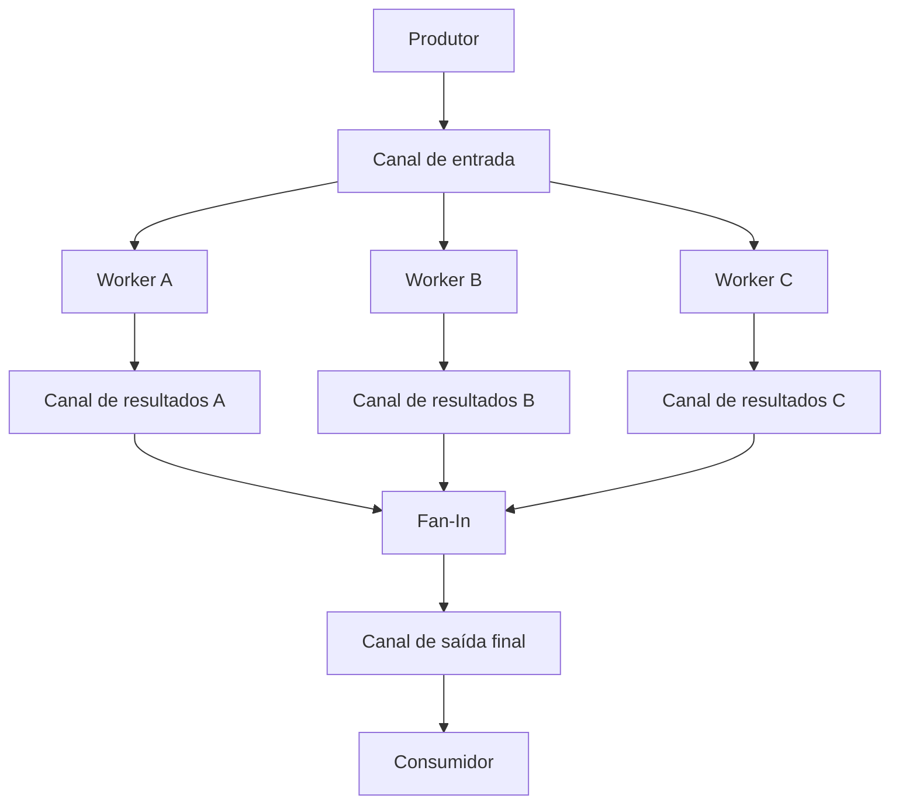

**Fan-Out** distribui trabalho entre vários workers. **Fan-In** reúne os resultados em um único fluxo. Em Go, esses padrões podem ser construídos com goroutines e channels: várias goroutines recebem tarefas de um canal, processam os valores e produzem resultados que o consumidor recebe por um canal final.

Antes de avançar, vale revisar [[goroutines|Goroutines em Go]], [[channels|Channels em Go]] e [[concorrencia-vs-paralelismo|concorrência e paralelismo]].

## 1. Como os dois padrões se conectam

Imagine que precisamos calcular o quadrado de muitos números:



O trecho entre a entrada e os workers é o **Fan-Out**. O trecho que junta os canais de resultados é o **Fan-In**. A sequência produtor → processamento → consumidor forma um **pipeline**, isto é, um fluxo organizado em etapas. Essa combinação aparece no [guia oficial de pipelines em Go](https://go.dev/blog/pipelines).

Neste modelo de Fan-Out, os workers **competem pelos valores da mesma entrada**. Cada envio é recebido por um worker; não entrega uma cópia para todos. Para transmitir cada evento a todos os consumidores, seria necessário implementar uma distribuição explícita de cópias, também chamada de *broadcast*.

Fan-In também pode reunir fontes independentes, como eventos de serviços diferentes, sem existir um Fan-Out anterior.

## 2. Programa completo: distribuir, processar e reunir

Salve como `main.go` e execute com `go run main.go`:

```go
package main

import (
    "fmt"
    "sync"
)

func gerar(numeros ...int) <-chan int {
    entrada := make(chan int)

    go func() {
        defer close(entrada)

        for _, numero := range numeros {
            entrada <- numero
        }
    }()

    return entrada
}

func quadrados(entrada <-chan int) <-chan int {
    saida := make(chan int)

    go func() {
        defer close(saida)

        for numero := range entrada {
            saida <- numero * numero
        }
    }()

    return saida
}

func fanIn(saidas ...<-chan int) <-chan int {
    saidaFinal := make(chan int)
    var wg sync.WaitGroup

    // Registra todas as encaminhadoras antes de iniciá-las.
    wg.Add(len(saidas))

    for _, saida := range saidas {
        go func(canal <-chan int) {
            defer wg.Done()

            for numero := range canal {
                saidaFinal <- numero
            }
        }(saida)
    }

    // Coordena o fechamento sem impedir o retorno de fanIn.
    go func() {
        wg.Wait()
        close(saidaFinal)
    }()

    return saidaFinal
}

func main() {
    entrada := gerar(1, 2, 3, 4, 5, 6)

    // Fan-Out: três workers recebem da mesma entrada.
    saidaA := quadrados(entrada)
    saidaB := quadrados(entrada)
    saidaC := quadrados(entrada)

    // Fan-In: os três canais viram um único fluxo de resultados.
    resultado := fanIn(saidaA, saidaB, saidaC)

    for numero := range resultado {
        fmt.Println(numero)
    }

    fmt.Println("Processamento concluído!")
}
```

O programa imprime `1`, `4`, `9`, `16`, `25` e `36`, cada um uma vez, em uma ordem que pode variar. Depois imprime `Processamento concluído!`.

As três chamadas a `quadrados` iniciam três workers. Eles recebem da mesma `entrada`, mas cada worker tem sua própria `saida`. O `fanIn` recebe essas saídas e inicia uma goroutine **encaminhadora por canal**, além de uma goroutine para coordenar o fechamento.

Há dois tipos de trabalho aqui: os workers calculam os quadrados; as encaminhadoras apenas transportam os resultados. A goroutine de fechamento não recebe nem processa números.

### Entendendo os tipos dos canais

| Tipo | Operações permitidas |
| --- | --- |
| `chan int` | Enviar, receber e fechar |
| `<-chan int` | Apenas receber |
| `chan<- int` | Enviar e fechar |
| `[]<-chan int` | Slice de canais que permitem apenas receber |

Retornar `<-chan int` deixa explícito que o chamador é consumidor desse canal. A função mantém internamente o `chan int` para enviar e fechar. A direção restringe as operações; a responsabilidade pelo fechamento continua sendo uma decisão do programa. Veja a [especificação de tipos de canais](https://go.dev/ref/spec#Channel_types).

Em `fanIn(saidas ...<-chan int)`, `...` permite passar vários canais como argumentos. Dentro da função, `saidas` é um slice. Se você já tiver um `[]<-chan int`, pode chamar `fanIn(canais...)`.

## 3. Fan-Out: quem recebe cada tarefa?

Quando vários workers executam `for numero := range entrada`, o canal distribui os envios entre os receptores disponíveis. Não é necessário um mutex para retirar os valores do canal.

Uma execução possível seria:

| Número recebido | Worker | Resultado |
| --- | --- | --- |
| 1 | A | 1 |
| 2 | C | 4 |
| 3 | B | 9 |
| 4 | A | 16 |
| 5 | B | 25 |
| 6 | C | 36 |

Essa divisão é apenas uma possibilidade. Não há garantia de rodízio, de quantidade igual de tarefas por worker ou de qual worker receberá um número específico. Um worker pode receber várias tarefas e outro nenhuma.

Isso funciona bem quando as tarefas podem ser processadas de forma independente. Se os workers acessarem o mesmo map, slice ou objeto mutável, os canais não tornam esse acesso automaticamente seguro; veja [[race-condition-mutex-sync-map|race condition e sincronização]].

Criar mais workers permite sobrepor tarefas. A execução simultânea de cálculos depende dos recursos disponíveis, e o ganho precisa ser medido. Para elevar ao quadrado seis números, o custo das goroutines e dos canais provavelmente supera qualquer benefício; o exemplo serve para estudar a coordenação.

## 4. Fan-In: o papel do WaitGroup

O `fanIn` precisa saber quando **todas as encaminhadoras terminaram de enviar**. Essa é a responsabilidade do `sync.WaitGroup`:

```go
wg.Add(len(saidas))
```

Se existem três canais de entrada, o contador começa em três. Cada encaminhadora usa `defer wg.Done()`, que reduz o contador quando a função retorna. `wg.Wait()` aguarda o contador chegar a zero. As chamadas a `Add` acontecem antes de iniciar as goroutines e antes de `Wait`. Consulte a [documentação de sync.WaitGroup](https://pkg.go.dev/sync#WaitGroup).

| Evento | Contador |
| --- | --- |
| `wg.Add(3)` | 3 |
| Encaminhadora A termina e chama `Done()` | 2 |
| Encaminhadora C termina e chama `Done()` | 1 |
| Encaminhadora B termina e chama `Done()` | 0 |
| `Wait()` retorna | 0 |

Cada encaminhadora termina quando o `range` esgota seu canal: ele foi fechado e todos os valores disponíveis foram recebidos. Como o envio para `saidaFinal` está dentro do laço, ela só chama `Done()` depois de concluir seus envios.

O WaitGroup acompanha as encaminhadoras criadas pelo `fanIn`, não diretamente os workers de `quadrados`. Neste exemplo, terminar de ler suas saídas depende de cada worker concluir seus envios e fechar seu canal.

## 5. Por que esperar em outra goroutine?

Este trecho é o centro da implementação:

```go
go func() {
    wg.Wait()
    close(saidaFinal)
}()

return saidaFinal
```

Ele separa duas necessidades: devolver o canal para o consumidor começar a receber e aguardar as encaminhadoras para fechar o canal com segurança.

Se a espera fosse executada antes do retorno, teríamos esta versão **incorreta para o exemplo**:

```go
// Trecho incorreto: aguarda antes de entregar o canal ao consumidor.
wg.Wait()
close(saidaFinal)
return saidaFinal
```

Com uma entrada que produz valores, a dependência circular seria:

1. Uma encaminhadora tenta executar `saidaFinal <- numero`.
2. Como `saidaFinal` não tem buffer, o envio espera um receptor.
3. O consumidor ainda está dentro da chamada a `fanIn`, esperando a função retornar.
4. `fanIn` está em `wg.Wait()`, esperando as encaminhadoras terminarem.
5. A encaminhadora não termina porque seu envio continua bloqueado.

Esse ciclo provoca um **deadlock**. Se todas as entradas estiverem vazias e forem fechadas, não haverá envio bloqueado; o problema aparece quando existe trabalho a encaminhar.

A goroutine adicional permite que `fanIn` retorne sem aguardar a conclusão do fluxo. O consumidor recebe enquanto as encaminhadoras enviam. Quando a última termina, a coordenadora fecha `saidaFinal`.

Não existe garantia de que o `return` será executado antes de qualquer outra goroutine começar. O que importa é que o retorno não depende de `Wait()` terminar.

> [!warning] Um buffer não resolve o ciclo de forma geral
> Com buffer, alguns envios podem prosseguir antes de existir um receptor. Se a capacidade acabar antes de todas as encaminhadoras terminarem, o bloqueio volta. O tamanho do buffer não deve substituir a coordenação do encerramento.

## 6. Quem fecha cada canal?

O fechamento comunica que não haverá novos envios. Ele precisa acontecer uma única vez, depois do último envio possível.

| Canal | Responsável pelo fechamento | Momento |
| --- | --- | --- |
| `entrada` | Produtor `gerar` | Depois de enviar todos os números |
| Saída de cada worker | O próprio worker `quadrados` | Depois de esgotar a entrada e enviar seus resultados |
| `saidaFinal` | Coordenadora do `fanIn` | Depois de todas as encaminhadoras chamarem `Done()` |

A sequência de encerramento do exemplo é:

1. O produtor conclui os envios e fecha `entrada`.
2. Os workers terminam de receber, concluem seus cálculos e envios e fecham suas saídas.
3. As encaminhadoras esgotam essas saídas e chamam `Done()`.
4. A coordenadora sai de `Wait()` e fecha `saidaFinal`.
5. O `range resultado` termina, e o consumidor imprime a mensagem final.

### Por que uma encaminhadora não pode fechar a saída compartilhada?

Ela sabe que **seus próprios envios** acabaram, mas não sabe se as outras ainda enviarão. Se a encaminhadora A fechar `saidaFinal` enquanto B tenta enviar, B causará `panic: send on closed channel`. Se duas tentarem fechar, a segunda causará `panic: close of closed channel`.

O consumidor também não deve fechar a saída para pedir que os produtores parem. Cancelamento exige um sinal separado, como veremos adiante.

### O que acontece se ninguém fechar saidaFinal?

Depois do último valor, o consumidor continua esperando outro envio. O `range` não detecta que os produtores terminaram; ele depende do fechamento. Mesmo que todas as encaminhadoras tenham terminado, o laço ficará bloqueado se a saída continuar aberta.

Fechar um canal não descarta valores no buffer. Eles ainda podem ser recebidos antes de o `range` terminar. Depois de esgotado, uma recepção com `valor, ok := <-canal` retorna o valor zero e `ok == false`; o `range` trata o fim automaticamente. Veja [recepção](https://go.dev/ref/spec#Receive_operator) e [close](https://go.dev/ref/spec#Close) na especificação.

## 7. Ordem dos resultados e pressão do consumidor

O Fan-In não ordena os resultados. Ele reúne os envios conforme as operações conseguem avançar. Um resultado de uma tarefa posterior pode aparecer antes de outro de uma tarefa anterior; a ordem observada também depende do escalonamento das goroutines.

Na implementação mostrada, uma encaminhadora por entrada preserva a sequência de valores **daquele canal**, mas a intercalação entre canais pode variar. Como o Fan-Out já divide a entrada entre workers, a ordem global do produtor não é preservada.

Se a ordem original for necessária, envie tarefas com um índice e devolva esse índice junto ao resultado. O consumidor pode guardar os resultados e ordenar pelo índice. Essa escolha exige memória e, para emitir resultados em ordem durante o processamento, pode exigir esperar uma tarefa mais lenta.

Há também **backpressure**, ou pressão do consumidor sobre as etapas anteriores. Se o consumidor estiver lento, a encaminhadora pode bloquear no envio; então o worker pode bloquear ao entregar seu resultado e o produtor pode bloquear ao enviar novas tarefas. Isso limita o avanço do fluxo em vez de acumular resultados indefinidamente.

Um buffer permite acumular uma quantidade limitada de valores e absorver diferenças temporárias de ritmo. Quando fica cheio, o envio volta a esperar. Escolha a capacidade conforme o volume, a memória disponível e medições da aplicação.

## 8. Limites da versão básica

O programa assume que todas as entradas do `fanIn` serão fechadas e que o consumidor receberá até a saída final fechar. Se uma dessas condições falhar, alguma goroutine pode ficar bloqueada indefinidamente, causando um **vazamento de goroutines**.

| Situação | Comportamento da versão básica |
| --- | --- |
| Nenhum canal: `fanIn()` | O contador começa em zero e a coordenadora fecha a saída sem produzir valores |
| Entrada já fechada e esgotada | Sua encaminhadora termina sem enviar |
| Entrada fechada com valores no buffer | Os valores são encaminhados antes de a encaminhadora terminar |
| Entrada `nil` | A recepção bloqueia indefinidamente e impede o fechamento final |
| Entrada aberta que nunca mais envia nem fecha | A encaminhadora fica esperando; a saída final permanece aberta |
| Consumidor para antes de receber tudo | Encaminhadoras podem ficar presas tentando enviar |
| O mesmo canal é passado duas vezes | Duas encaminhadoras competem pelos valores; isso não duplica cada valor |

O caso `nil` difere de um canal fechado: enviar ou receber em um canal `nil` bloqueia, enquanto um canal fechado e esgotado permite detectar o fim.

## 9. Cancelamento com context.Context

O consumidor pode decidir parar após o primeiro resultado, atingir um timeout ou encontrar um erro. Para permitir esse encerramento antecipado, cada etapa precisa conseguir abandonar suas operações bloqueantes.

`context.WithCancel` fornece um contexto e uma função `cancel`. O fechamento de `ctx.Done()` sinaliza o pedido de cancelamento; `cancel()` não espera o trabalho terminar. As goroutines precisam observar o sinal, por exemplo com `select`. Esse comportamento está documentado no [pacote context](https://pkg.go.dev/context).

O exemplo abaixo é um **segundo programa completo**. Salve-o separadamente como `main.go` e execute com `go run main.go`:

```go
package main

import (
    "context"
    "fmt"
    "sync"
)

func gerarCtx(ctx context.Context, numeros ...int) <-chan int {
    entrada := make(chan int)

    go func() {
        defer close(entrada)

        for _, numero := range numeros {
            select {
            case <-ctx.Done():
                return
            case entrada <- numero:
            }
        }
    }()

    return entrada
}

func quadradosCtx(ctx context.Context, entrada <-chan int) <-chan int {
    saida := make(chan int)

    go func() {
        defer close(saida)

        for {
            var numero int

            select {
            case <-ctx.Done():
                return
            case valor, ok := <-entrada:
                if !ok {
                    return
                }
                numero = valor
            }

            select {
            case <-ctx.Done():
                return
            case saida <- numero * numero:
            }
        }
    }()

    return saida
}

func fanInCtx(ctx context.Context, saidas ...<-chan int) <-chan int {
    saidaFinal := make(chan int)
    var wg sync.WaitGroup
    wg.Add(len(saidas))

    for _, saida := range saidas {
        go func(canal <-chan int) {
            defer wg.Done()

            for {
                var numero int

                select {
                case <-ctx.Done():
                    return
                case valor, ok := <-canal:
                    if !ok {
                        return
                    }
                    numero = valor
                }

                select {
                case <-ctx.Done():
                    return
                case saidaFinal <- numero:
                }
            }
        }(saida)
    }

    go func() {
        wg.Wait()
        close(saidaFinal)
    }()

    return saidaFinal
}

func main() {
    ctx, cancel := context.WithCancel(context.Background())
    defer cancel()

    entrada := gerarCtx(ctx, 1, 2, 3, 4, 5, 6)
    saidaA := quadradosCtx(ctx, entrada)
    saidaB := quadradosCtx(ctx, entrada)
    resultado := fanInCtx(ctx, saidaA, saidaB)

    if numero, ok := <-resultado; ok {
        fmt.Println("Primeiro resultado recebido:", numero)
    }

    // Pede que todas as etapas abandonem o trabalho restante.
    cancel()

    // Descarta eventuais valores e aguarda o fechamento do Fan-In.
    for range resultado {
    }

    fmt.Println("Fan-In encerrado:", ctx.Err())
}
```

### Por que há dois selects nas encaminhadoras?

Existem dois pontos onde uma encaminhadora pode ficar presa: esperando um valor da entrada e esperando alguém receber da saída. Os dois precisam observar `ctx.Done()`.

Se apenas o envio tivesse `select`, um `for numero := range canal` continuaria bloqueado quando a entrada não produzisse valores nem fechasse. A versão com dois `select`s permite cancelar ambas as esperas, inclusive quando a entrada é `nil`.

O produtor e os workers recebem o **mesmo contexto**. Cancelar apenas o Fan-In deixaria as etapas anteriores sujeitas a bloquear ao enviar para canais que ninguém mais consome. O cancelamento precisa alcançar todo o pipeline.

O laço final aguarda o fechamento da saída do Fan-In, confirmando que suas encaminhadoras terminaram. Isso não é uma espera explícita pelo término do produtor e dos workers, que também observarão o contexto. Se a aplicação precisar confirmar o fim de todas as etapas antes de retornar, acompanhe essas goroutines com uma coordenação adicional, como outro WaitGroup.

### Cancelamento é cooperativo

Se vários casos de um `select` estiverem prontos, um deles é escolhido; o cancelamento não tem prioridade automática. Portanto, alguns valores ainda podem circular depois de `cancel()`. O exemplo descarta esses valores enquanto aguarda o fechamento, sem prometer um corte exato no instante do cancelamento.

Também não basta receber um contexto para interromper um cálculo longo ou uma operação externa: essa operação precisa observar o contexto ou oferecer uma API que o aceite. Para definir um prazo, use `context.WithTimeout` e mantenha a chamada a `cancel` para liberar os recursos associados.

## 10. Worker pool, erros e escolha do padrão

O conjunto fixo de workers é um **worker pool**. É possível dar a cada worker uma saída e juntá-las com `fanIn`, como fizemos, ou fazer todos enviarem diretamente para um canal compartilhado, como na nota de [[channels|Channels em Go]]. Na segunda opção, uma coordenadora ainda precisa esperar todos os remetentes antes de fechar a saída, mas não são necessárias goroutines extras para encaminhar resultados.

Para muitas tarefas, um pool limita o número de workers ativos. A quantidade adequada depende de tempo de espera, custo de CPU, memória e limites de serviços externos; não existe um número universal. Ter três workers limita o trabalho nessa etapa a três tarefas em andamento, mas buffers e etapas anteriores ainda podem acumular itens.

Os exemplos não têm operações que retornam erros. Em um caso real, decida se o processamento deve continuar com os demais itens ou parar no primeiro erro. Uma opção é enviar uma estrutura que contenha o resultado e um campo `Err error`. Se o consumidor decidir parar, ele deve cancelar o contexto compartilhado. **Fechar o canal, sozinho, não informa se houve sucesso, erro ou cancelamento**; defina como o consumidor obtém essa informação.

Use Fan-Out quando houver tarefas independentes que possam avançar concorrentemente, e Fan-In quando o consumidor precisar receber resultados de várias fontes por uma única interface. Ao revisar a implementação, confira:

- Quem envia e quem recebe em cada canal?
- Quem fecha cada canal, e como sabe que todos os envios terminaram?
- O consumidor consegue começar a receber antes de qualquer espera pela conclusão?
- O que acontece se ele desistir antes do fim?
- A ordem dos resultados importa?

## Referências

- [Go Concurrency Patterns: Pipelines and cancellation](https://go.dev/blog/pipelines)
- [sync.WaitGroup](https://pkg.go.dev/sync#WaitGroup)
- [context.Context e cancelamento](https://pkg.go.dev/context)
- [Especificação de Go: canais](https://go.dev/ref/spec#Channel_types)
- [Especificação de Go: select](https://go.dev/ref/spec#Select_statements)
